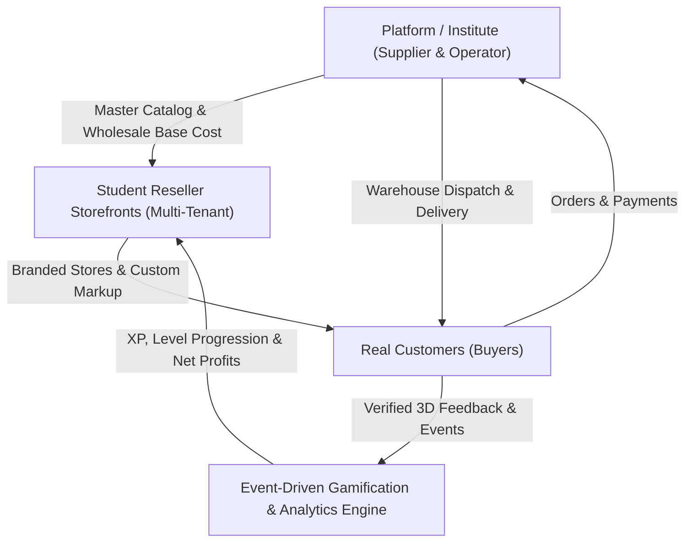

# Commercial E-Commerce Reseller & Training Platform

> **"Learn by running a real business."**  
> A multi-tenant commercial e-commerce platform where students operate real reseller stores, sell real physical products supplied centrally by the institute, collect real customer reviews and net revenues, and progress through a structured, event-driven learning curriculum.

---

## 🌟 Overview

The platform bridges theoretical e-commerce education with live commercial operations:
- **Central Master Catalog:** The institute manages product sourcing, base wholesale pricing, and central fulfillment logistics.
- **Multi-Tenant Student Stores:** Students customize their storefront branding, set retail prices, market products, and earn real net profits.
- **Real Customer Experience:** End-consumers interact with high-speed storefronts, make real payments, and receive delivered physical items.
- **Tri-Dimensional Verified Reviews:** Customer ratings are cleanly separated across **Product Quality**, **Store Service**, and **Delivery Speed** with `✓ Verified Purchase` badges.
- **Event-Driven Gamification:** Key business events (`StorePublished`, `OrderDelivered`, `RevenueMilestoneReached`) automatically trigger career level progression from **Store Starter** to **Top Performer**.

---

## 📚 Documentation

Detailed specifications and architectural documents are located in the [`docs/`](docs/) directory:

- [**Business Logic Architecture (`docs/business_logic.md`)](docs/business_logic.md) - Platform concept, business model, actor responsibilities, pricing logic, and training philosophy.
- [**Requirement Analysis (`docs/requirement_analysis.md`)](docs/requirement_analysis.md) - Software Requirements Specification (SRS), functional/non-functional requirements, data domain models, and sequence workflows.
- [**Product Requirements Document (`docs/prd.md`)](docs/prd.md) - Engineering PRD, PostgreSQL 16 DDL schema, REST/Headless API contracts, and event-driven messaging topology.

---

## 🚀 Key Modules & Architecture

---

## 🛠 Tech Stack

A modern, lightweight monorepo — modular monolith, no microservices/broker overhead. Full rationale in [`docs/tech_stack.md`](docs/tech_stack.md).

- **Monorepo:** pnpm workspaces + Turborepo
- **Backend:** NestJS (TypeScript) modular monolith, Prisma ORM
- **Storefront:** Next.js 14+ (App Router, TailwindCSS)
- **Dashboards:** Vite + React SPA (Student & Institute Admin portals)
- **Database:** PostgreSQL 16, multi-tenant via `store_id` scoping
- **Caching, Sessions & Jobs:** Redis 7 + BullMQ
- **Events:** In-process domain events (`@nestjs/event-emitter`)
- **Storage:** MinIO (S3-compatible object storage)
- **Deployment:** Docker Compose on a self-hosted VPS, behind Caddy

---

## 📄 License

This project is proprietary and maintained for commercial reseller training operations.
