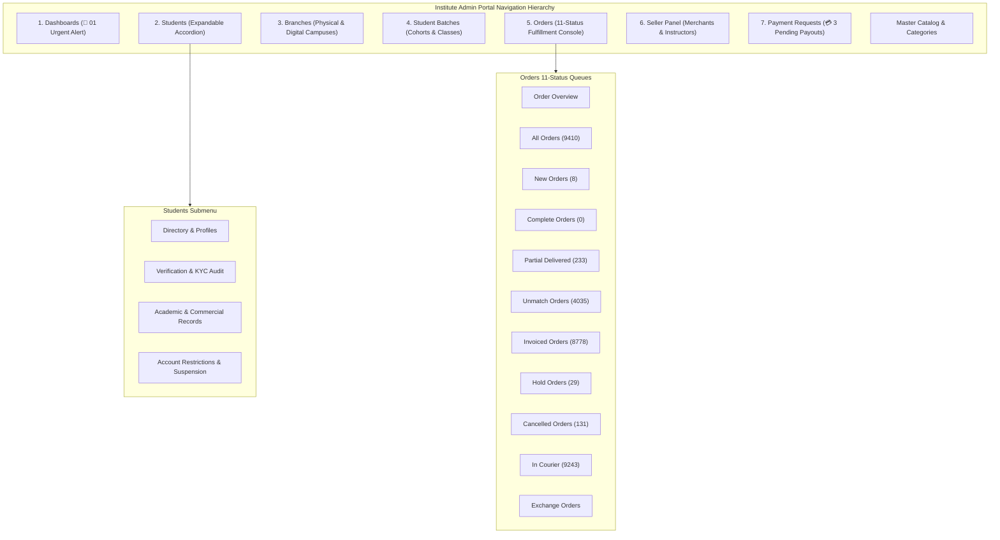

# Overall Platform Task Plan: Enterprise Admin Portal & Operations Architecture

**Document ID:** PLAN-ADMIN-OVERALL-2026-V1  
**Target Platform:** Commercial E-Commerce Reseller & Training Platform  
**Scope:** Complete cross-phase architectural blueprint and deep implementation plan for the Institute Admin Portal.  
**Related Documents:**  
- [`docs/business_logic.md`](./business_logic.md) (Section 14: Institute Admin Portal Architecture & Navigation Hierarchy)  
- [`docs/features.md`](./features.md) (Feature 15: Institute Admin Portal & Operational Hub; Feature 7: Multi-Status Order Management)  
- [`docs/prd.md`](./prd.md) (Epic 6: Platform Operations & Administration; §4.1 Schema DDL; §5.2 REST Endpoints)  
- [`docs/requirement_analysis.md`](./requirement_analysis.md) (Module 8: Operational Governance; Multi-Status State Machine)  
- [`docs/tasks/phase_1_foundation.md`](./tasks/phase_1_foundation.md) (Scaffolding & Layout Shell)  
- [`docs/tasks/phase_2_core_commerce.md`](./tasks/phase_2_core_commerce.md) (Order Processing & 11-Status State Transitions)  
- [`docs/tasks/phase_5_platform_operations.md`](./tasks/phase_5_platform_operations.md) (The Core Detailed Execution Phase)  

---

## 1. Executive Summary & Phasing Strategy

The Institute Admin Portal is the central operational control plane for platform operators, campus directors, fulfillment supervisors, and financial auditing teams. Rather than isolating this development into a single phase, the implementation follows a structured lifecycle:
1. **Phase 1 (Foundation):** Scaffolds core database enums (`UserRole`, `OrderStatus` with all 11 states) and establishes the persistent navigation shell (`AdminLayout.tsx`) with alert bubble indicators and expandable menus.
2. **Phase 2 (Core Commerce):** Establishes order state machine transitions across all 11 statuses, pick-and-pack workflow, and 3PL courier integrations.
3. **Phase 3 (Trust & Reviews):** Implements review dispute triage and student store reputation moderation.
4. **Phase 4 (Growth & Analytics):** Deploys cohort commercial performance leaderboards and conversion funnel analytics.
5. **Phase 5 (Platform Operations & Monetization) — THE CORE UPDATING PHASE:** Fully implements all 7 functional admin modules, dedicated REST APIs, high-volume operational consoles, double-entry financial settlement, and automated Playwright E2E suites.

---

## 2. Cross-Phase Traceability & Responsibilities

| Phase | Phase Name | Admin Portal Responsibilities & Scope | Source File |
| :--- | :--- | :--- | :--- |
| **Phase 1** | **Foundation** | **Scaffolding Layer:** • Core `UserRole` enums (`BRANCH_MANAGER`, `SELLER`, etc.) • Complete `OrderStatus` enum (11 states) to eliminate future breaking DB migrations • Scaffolding for `Branch` and `StudentBatch` models • Persistent `AdminLayout` navigation shell with route placeholders, alert bubble (`01`), expandable student accordion, and payment badge (`3`) | [`docs/tasks/phase_1_foundation.md`](./tasks/phase_1_foundation.md) |
| **Phase 2** | **Core Commerce** | **Order Processing Layer:** • Checkout-to-order creation pipeline • Initial warehouse fulfillment console in `admin-dashboard` • Multi-status order queue filtering (`NEW`, `INVOICED`, `IN_COURIER`, `DELIVERED`, `COMPLETE`, `HOLD`, `CANCELLED`, `UNMATCH`, `EXCHANGE`) • Basic 3PL courier dispatch integration (Pathao, Steadfast, RedX) | [`docs/tasks/phase_2_core_commerce.md`](./tasks/phase_2_core_commerce.md) |
| **Phase 3** | **Trust & Engagement** | **Reputation & Moderation Layer:** • Admin review moderation queue • Tri-dimensional customer review dispute handling • Store reputation scores and seller complaint metrics | [`docs/tasks/phase_3_trust_engagement.md`](./tasks/phase_3_trust_engagement.md) |
| **Phase 4** | **Growth & Training** | **Cohort Analytics Layer:** • Batch commercial performance leaderboards • Gamified student challenge verification • Conversion funnel diagnostics across student stores | [`docs/tasks/phase_4_growth_training.md`](./tasks/phase_4_growth_training.md) |
| **Phase 5** | **Platform Operations & Monetization** | **THE CORE DETAILED UPDATING PHASE:** • Executive Dashboards with real-time alert engine (bubble `01`) • Expandable Students management suite (Directory, KYC audit, records, store suspension) • Campus Branches management (Physical/Digital campuses, manager assignment, hub links) • Student Batches management (Cohort creation, capacity caps, student bulk enrollment, mentor assignment) • Production Orders multi-status fulfillment console with all 11 status queues, batch invoicing, barcode discrepancy quarantine (`UNMATCH`), and exchange pipelines • External Seller Panel (Merchant & instructor onboarding, commission/wholesale margin contracts, compliance scorecards) • Financial Payment Requests workbench with live pending count `3`, immutable double-entry ledger verification, and disbursement auditing | [`docs/tasks/phase_5_platform_operations.md`](./tasks/phase_5_platform_operations.md) |

---

## 3. Phase 1 Updating Tasks (Scaffolding & Shell)

- [x] **Task 1.2: Database Package Enums & Scaffold Models**
  - Update `packages/db/prisma/schema.prisma`:
    - Enum `UserRole`: Add `BRANCH_MANAGER`, `PRODUCT_MANAGER`, `ORDER_MANAGER`, `TRAINING_MANAGER`, `SUPPORT_AGENT`, `SELLER`.
    - Enum `OrderStatus`: Add `NEW`, `INVOICED`, `IN_COURIER`, `PARTIAL_DELIVERED`, `DELIVERED`, `COMPLETE`, `HOLD`, `CANCELLED`, `UNMATCH`, `EXCHANGE`, `RETURNED`, `REFUNDED`.
    - Models `Branch` and `StudentBatch` initial scaffolding.
- [x] **Task 1.9: Admin Dashboard Navigation Shell (`apps/admin-dashboard`)**
  - File: `apps/admin-dashboard/src/components/AdminLayout.tsx`
  - Implement sidebar layout rendering:
    1. **Dashboards** (with red notification alert bubble `01`).
    2. **Students** (expandable accordion: *Directory & Profiles*, *Verification & KYC*, *Student Records*, *Restrictions*).
    3. **Branches** (`/branches`).
    4. **Student Batches** (`/batches`).
    5. **Orders** (expanded 11 queues): *Order Overview*, *All Orders (9410)*, *New Orders (8)*, *Complete Orders (0)*, *Partial Delivered (233)*, *Unmatch Orders (4035)*, *Invoiced Orders (8778)*, *Hold Orders (29)*, *Cancelled Orders (131)*, *In Courier (9243)*, *Exchange Orders*.
    6. **Seller Panel** (`/sellers`).
    7. **Payment Requests** (with pending count badge `3` at `/payouts`).
    - Catalog Management (*Master Catalog*, *Categories*).

---

## 4. Phase 2 Updating Tasks (Order State Machine & Fulfillment)

- [x] **Task 2.8: Order State Machine & Multi-Status Transitions**
  - File: `apps/api/src/orders/order-state-machine.ts`
  - Implement state transition graph supporting `NEW` $\to$ `INVOICED` $\to$ `IN_COURIER` $\to$ `PARTIAL_DELIVERED` $\to$ `COMPLETE`, plus side-branches for `HOLD`, `UNMATCH`, `EXCHANGE`, and `CANCELLED`.
  - Handle inventory locks and automatic stock release on cancellation.
- [x] **Task 2.12: Admin Warehouse Fulfillment Console (`apps/admin-dashboard`)**
  - File: `apps/admin-dashboard/src/pages/fulfillment/FulfillmentPage.tsx`
  - Implement pick-and-pack workflow, order queue filtering by status, and 3PL courier consignment generation (Pathao, Steadfast, RedX).

---

## 5. Phase 5: The Detailed Primary Updating Phase (Platform Operations & Monetization)

### 5.1 Database & Schema Implementation (`packages/db`)

- [x] **Task 5.1: Monetization, Operations & Dynamic RBAC Schema Expansion**
  - Update `packages/db/prisma/schema.prisma`:
    - Model `Branch`: `id`, `name`, `code` (unique), `branchType` (`PHYSICAL`/`DIGITAL`), `address`, `city`, `contactPhone`, `contactEmail`, `managerId` (FK User nullable), `isActive`, timestamps.
    - Model `StudentBatch`: `id`, `branchId` (FK Branch nullable), `name`, `batchCode` (unique), `instructorId` (FK User nullable), `startDate`, `endDate`, `maxCapacity`, `status` (`UPCOMING`/`ACTIVE`/`COMPLETED`), timestamps.
    - Model `BatchEnrollment`: `id`, `batchId` (FK StudentBatch), `studentId` (FK User), `status` (`ENROLLED`/`GRADUATED`/`DROPPED`), `enrolledAt`. Unique constraint `[batchId, studentId]`.
    - Model `SellerProfile`: `id`, `userId` (FK User unique), `companyName`, `sellerType` (`MERCHANT`/`INSTRUCTOR`/`SUPPLIER`), `tradeLicenseNumber`, `tinBinNumber`, `commissionRate`, `complianceScore`, `status` (`PENDING`/`APPROVED`/`SUSPENDED`), timestamps.
    - Model `PayoutRequest`: `id`, `storeId` (FK Store nullable), `studentId` (FK User), `sellerId` (FK SellerProfile nullable), `amount`, `paymentMethod` (`BKASH`/`NAGAD`/`BANK_TRANSFER`), `accountDetails` (Jsonb), `status` (`PENDING`/`APPROVED`/`REJECTED`/`PROCESSED`), `transactionReference`, `adminNotes`, `reviewedById` (FK User nullable), timestamps.
    - Model `SubscriptionPlan`: `id`, `name`, `code` (unique), `monthlyPrice`, `yearlyPrice`, `maxProducts`, `allowCustomDomain`, `platformCommissionPercent`, `features` (Text[]), `isActive`.
    - Model `StudentSubscription`: `id`, `studentId` (FK User unique), `planId` (FK SubscriptionPlan), `status` (`ACTIVE`/`PAST_DUE`/`CANCELLED`), `currentPeriodStart`, `currentPeriodEnd`.
    - Dynamic RBAC Models: `Permission`, `Role`, `RolePermission`, `UserRoleAssignment`.
  - Apply migration `0005_operations_and_monetization`.

---

### 5.2 Backend API Implementation (`apps/api`)

- [x] **Task 5.2: Dynamic RBAC Guard & Permission Service (`auth`)**
  - Implement `DynamicPermissionsGuard` evaluating `@RequirePermission()` decorators with Redis caching.
  - Endpoints: `GET/POST /api/v1/admin/roles`, `PUT /api/v1/admin/roles/:id/permissions`, `POST /api/v1/admin/users/:id/roles`.

- [x] **Task 5.3: Immutable Financial Ledger & Wallet Service (`finance`)**
  - Implement append-only `ledger_entries` (no UPDATE or DELETE).
  - Balance calculator: $\text{Balance} = \sum(\text{Credits}) - \sum(\text{Debits})$.
  - Endpoints: `POST /api/v1/student/wallet/withdraw`, `GET /api/v1/student/wallet/statement`, `GET /api/v1/admin/finance/payouts`.

- [x] **Task 5.4: Subscription Plans & Quota Enforcement (`subscriptions`)**
  - Quota guard blocking product catalog imports beyond plan limits (Free: 10, Starter: 30, Pro: 100, Business: $\infty$).
  - Custom domain gating for paid tiers.

- [x] **Task 5.5: Executive Dashboards & Alert Notification Engine (`admin`)**
  - Implement `InstituteDashboardService.getOverviewMetrics()`: Platform GMV, net revenue, active stores count, registered students.
  - Implement Urgent Alert Evaluator (`AlertService`): Generates actionable alerts powering the **`01` alert bubble**.
  - Endpoints: `GET /api/v1/admin/dashboard/overview`, `GET /api/v1/admin/dashboard/alerts`.

- [x] **Task 5.6: Expandable Students Governance & KYC API (`admin`)**
  - Searchable multi-field directory (student name, phone, NID, store subdomain, batch, status).
  - Identity verification workbench: preview and audit NID/Passport files.
  - Academic & commercial records aggregation: combines course milestone progress with real store GMV and net profit.
  - Endpoints: `GET /api/v1/admin/students`, `GET /api/v1/admin/students/:id`, `PATCH /api/v1/admin/students/:id/status` (store suspension with audit notes), `POST /api/v1/admin/students/:id/verify-kyc`.

- [x] **Task 5.7: Campus Branches & Regional Logistics API (`admin`)**
  - Manage physical campuses (Dhaka Main, Chittagong Regional Hub, Sylhet Digital Center) and Virtual Campus.
  - Assign campus directors and coordinators with branch-scoped data isolation.
  - Map local fulfillment depots, warehouse pickup points, and delivery zones.
  - Endpoints: `GET /api/v1/admin/branches`, `POST /api/v1/admin/branches`, `PUT /api/v1/admin/branches/:id`, `GET /api/v1/admin/branches/:id/analytics`.

- [x] **Task 5.8: Student Batches & Cohort Scheduling API (`admin`)**
  - Cohort engine (`batchCode`, `branchId`, `instructorId`, `startDate`, `endDate`, `maxCapacity`).
  - Student bulk enrollment mapping (individual assignment or CSV import).
  - Commercial sales leaderboard comparing aggregate revenue across batches.
  - Endpoints: `GET /api/v1/admin/batches`, `POST /api/v1/admin/batches`, `POST /api/v1/admin/batches/:id/enrollments`, `GET /api/v1/admin/batches/:id/leaderboard`.

- [x] **Task 5.9: Orders Multi-Status Fulfillment API (`orders` + `admin`)**
  - Multi-status aggregator returning counts for all **11 queues**:
    `{ all: 9410, new: 8, complete: 0, partialDelivered: 233, unmatch: 4035, invoiced: 8778, hold: 29, cancelled: 131, inCourier: 9243, exchange: 14 }`.
  - Batch tax invoice generation (`/invoice`).
  - Hold order pausing with documented reason (`/hold`).
  - Barcode & SKU discrepancy quarantine and resolution (`/unmatch/flag`, `/unmatch/reconcile`).
  - 3PL courier consignment dispatch (`/dispatch`).
  - Item replacement and course exchange workflow (`/exchange`).
  - Endpoints: `GET /api/v1/admin/orders/counts`, `GET /api/v1/admin/orders`, `POST /api/v1/admin/orders/:id/*`.

- [x] **Task 5.10: External Seller Panel & Merchant Governance API (`admin`)**
  - Onboarding registry for third-party brand suppliers and external instructors.
  - Configurable commission splits and wholesale base prices.
  - Seller compliance scorecards (fulfillment SLA, defect rates, dispute logs).
  - Endpoints: `GET /api/v1/admin/sellers`, `POST /api/v1/admin/sellers`, `POST /api/v1/admin/sellers/:id/commission`, `GET /api/v1/admin/sellers/:id/scorecard`.

- [x] **Task 5.11: Financial Payment Requests & Settlement API (`finance` + `admin`)**
  - Payout request queue with live **pending badge `3`**.
  - Automated double-entry ledger balance validation before disbursement.
  - Settlement approval requiring external transaction reference (`BK-981188-TRX`).
  - Rejection workflow with documented remarks, immediately unlocking held wallet balance.
  - Endpoints: `GET /api/v1/admin/finance/payment-requests`, `POST /api/v1/admin/finance/payment-requests/:id/approve`, `POST /api/v1/admin/finance/payment-requests/:id/reject`.

---

### 5.3 Frontend Implementation (`apps/admin-dashboard` & `apps/student-dashboard`)

- [x] **Task 5.12: Admin Portal Navigation Shell & Layout (`apps/admin-dashboard`)**
  - File: `apps/admin-dashboard/src/components/AdminLayout.tsx`
  - Sidebar with active tab styling and dynamic badges:
    1. **Dashboards** (alert bubble `01`).
    2. **Students** (expandable: Directory, KYC Review, Records, Restrictions).
    3. **Branches** (`/branches`).
    4. **Student Batches** (`/batches`).
    5. **Orders** (11 queues with badges: Overview, 9410, 8, 0, 233, 4035, 8778, 29, 131, 9243, Exchange).
    6. **Seller Panel** (`/sellers`).
    7. **Payment Requests** (badge `3`).
    - Catalog Management (*Master Catalog*, *Categories*).

- [x] **Task 5.13: Executive Dashboards Screen (`apps/admin-dashboard`)**
  - File: `apps/admin-dashboard/src/pages/dashboards/ExecutiveDashboardPage.tsx`
  - Real-time KPI cards (Platform GMV, Net Margin, Active Stores, Registered Students).
  - Urgent alert banner displaying the `01` notification with direct action links.
  - Warehouse dispatch velocity charts & 3PL delivery SLA gauges.

- [x] **Task 5.14: Expandable Students Governance Suite (`apps/admin-dashboard`)**
  - File: `apps/admin-dashboard/src/pages/students/StudentGovernancePage.tsx`
  - Master roster with tabs for *Directory*, *KYC Review*, *Records*, *Suspensions*.
  - Student profile modal showing enrolled batches, store subdomain, and live store toggle.
  - Document review modal: zoomable NID/Passport preview with "Verify" and "Reject" actions.
  - "Suspend Store" dialog: Reason dropdown (Fraud, Policy Violation, Inactive) + audit note.

- [x] **Task 5.15: Campus Branches Management Screen (`apps/admin-dashboard`)**
  - File: `apps/admin-dashboard/src/pages/branches/BranchesPage.tsx`
  - Campus cards (Dhaka, Chittagong, Sylhet, Digital Campus) with manager assignment.
  - "Add/Edit Branch" modal and branch analytics drawer.

- [x] **Task 5.16: Student Batches & Cohorts Screen (`apps/admin-dashboard`)**
  - File: `apps/admin-dashboard/src/pages/batches/BatchesPage.tsx`
  - Cohort schedule calendar and batch list table.
  - "Create Batch" drawer: batch code, branch selector, instructor assignment, start/end dates, max capacity.
  - "Student Assignment" modal: bulk CSV student import or checkbox selection.
  - Cohort commercial sales leaderboard.

- [x] **Task 5.17: Orders Multi-Status Operations Console (`apps/admin-dashboard`)**
  - File: `apps/admin-dashboard/src/pages/orders/OrdersOperationsPage.tsx`
  - Tabbed status bar with active volume badges (Overview, 9410, 8, 0, 233, 4035, 8778, 29, 131, 9243, Exchange).
  - Modals for Batch Invoicing, Order Hold, Barcode Discrepancy Reconciliation, 3PL Courier Dispatch, and Exchanges.

- [x] **Task 5.18: Seller Panel Screen (`apps/admin-dashboard`)**
  - File: `apps/admin-dashboard/src/pages/sellers/SellerPanelPage.tsx`
  - External merchant and instructor table with status badges (`PENDING`, `APPROVED`, `SUSPENDED`).
  - Commission rate editor modal and compliance scorecard drawer.

- [x] **Task 5.19: Financial Payment Requests Approval Portal (`apps/admin-dashboard`)**
  - File: `apps/admin-dashboard/src/pages/payouts/PayoutApprovalPage.tsx`
  - Pending withdrawal requests queue with badge `3`.
  - Double-entry ledger validation indicator.
  - "Approve & Settle" modal: enter bank transaction reference or bKash TrxID, attach PDF receipt.

- [x] **Task 5.20: Dynamic Roles & Permissions Matrix (`apps/admin-dashboard`)**
  - File: `apps/admin-dashboard/src/pages/roles/RolesManagerPage.tsx`
  - Role creation drawer and checkbox permission matrix grouped by domain (Catalog, Orders, Finance, Governance).

- [x] **Task 5.21: Student Wallet & Billing Suite (`apps/student-dashboard`)**
  - Wallet & Earnings Screen (`/wallet`): Available Balance (`৳14,200`), Pending Clearance (`৳2,500`), Total Withdrawn (`৳45,000`), "Request Payout" modal, and ledger statement.
  - Subscription Plan & Billing Screen (`/billing`): Tier comparison cards (Free, Starter, Pro, Business), active plan indicator, and upgrade flow.

---

### 5.4 Unit & Integration Testing Tasks

- [x] **Task 5.22: Financial Ledger Invariant Unit Tests (Vitest)**
  - File: `apps/api/src/finance/ledger.service.spec.ts`
  - Tests: Append-only constraint, balance summation, double-spend prevention, negative balance block.
- [x] **Task 5.23: Dynamic RBAC Guard Unit Tests (Vitest)**
  - File: `apps/api/src/auth/dynamic-permissions.guard.spec.ts`
  - Tests: Granular permission evaluation, 403 Forbidden enforcement, Super Admin bypass.
- [x] **Task 5.24: Subscription Quota Integration Tests (Vitest)**
  - File: `apps/api/test/subscription-quotas.e2e-spec.ts`
  - Tests: Product import limits, custom domain access gating.
- [x] **Task 5.25: Payout Workflow Integration Tests (Vitest)**
  - File: `apps/api/test/payout-workflow.e2e-spec.ts`
  - Tests: Withdrawal request hold, admin approval with TrxID, ledger debit posting, rejection balance restoration.
- [x] **Task 5.26: Orders Multi-Status Fulfillment & Aggregation Tests (Vitest)**
  - File: `apps/api/test/admin-orders-fulfillment.e2e-spec.ts`
  - Tests: 11-queue count aggregation (`/counts`), invoice locking, hold pausing, unmatch discrepancy quarantine, courier dispatch.
- [x] **Task 5.27: Campus Branches & Batches Integration Tests (Vitest)**
  - File: `apps/api/test/branches-batches.e2e-spec.ts`
  - Tests: Physical/digital campus creation, cohort batch scheduling, bulk student enrollment uniqueness, cohort sales leaderboard aggregation.

---

### 5.5 End-to-End (E2E) Testing (Playwright)

- [x] **Task 5.28: Student Payout & Admin Settlement Lifecycle (Playwright)**
  - File: `tests/e2e/payout-governance-flow.spec.ts`
  - Test Flow: Student submits bKash payout request $\to$ Admin views pending request (badge `3`) $\to$ Admin enters TrxID $\to$ Ledger updates $\to$ Student verifies settlement.
- [x] **Task 5.29: Admin Operations & Multi-Status Order Dispatch (Playwright)**
  - File: `tests/e2e/admin-operations-orders.spec.ts`
  - Test Flow: Admin views sidebar with alert `01`, expandable students, branches, batches, orders (11 badges), sellers, and payouts $\to$ Transitions New order (8) to Invoiced (8778) $\to$ Dispatches to Courier (9243) $\to$ Creates campus branch $\to$ Creates batch and maps students $\to$ Verifies sales leaderboard.

---

## 6. Definition of Done (DoD) Checklist

- [x] **Executive Dashboards:** Operational KPI cards and dynamic red notification bubble displaying `01` urgent alert count.
- [x] **Students Suite:** Searchable directory, KYC document audit workbench, and one-click store suspension with audit logging.
- [x] **Campus Branches:** Physical and digital campus administration with assigned managers and regional warehouse hub links.
- [x] **Student Batches:** Cohorts with schedules, capacities, bulk student assignment, and live commercial leaderboards.
- [x] **Orders Multi-Status Console:** All 11 status queues render with accurate volume counts:
  - *Order Overview*
  - *All Orders (9410)*
  - *New Orders (8)*
  - *Complete Orders (0)*
  - *Partial Delivered (233)*
  - *Unmatch Orders (4035)*
  - *Invoiced Orders (8778)*
  - *Hold Orders (29)*
  - *Cancelled Orders (131)*
  - *In Courier (9243)*
  - *Exchange Orders*
- [x] **Unmatch Discrepancy Quarantine:** SKU/barcode mismatches quarantine orders into `UNMATCH` until audited.
- [x] **Exchange Workflow:** Order exchanges trigger replacement dispatches without corrupting original financial transactions.
- [x] **Seller Panel:** External merchants and instructors onboarded with wholesale contracts and compliance scorecards.
- [x] **Payment Requests:** Payout requests queue displays live badge `3`, validates against cleared ledger profits, and enforces transaction ID entry upon approval.
- [x] **Double-Entry Ledger:** Immutable append-only ledger strictly guarantees zero balance race conditions.
- [x] **Dynamic RBAC:** Granular database permissions replace hardcoded roles.
- [x] **Test Coverage:** All unit, integration, and E2E test suites pass with $\ge 85\%$ test coverage across all financial, governance, and order fulfillment modules.
