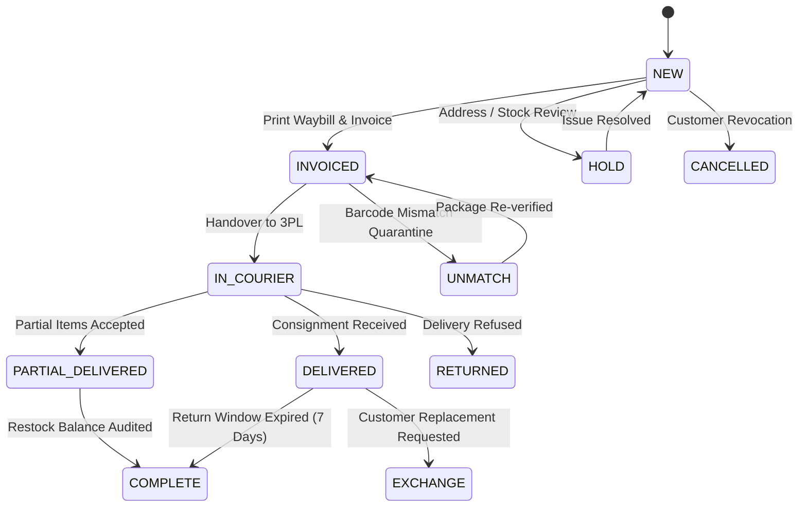
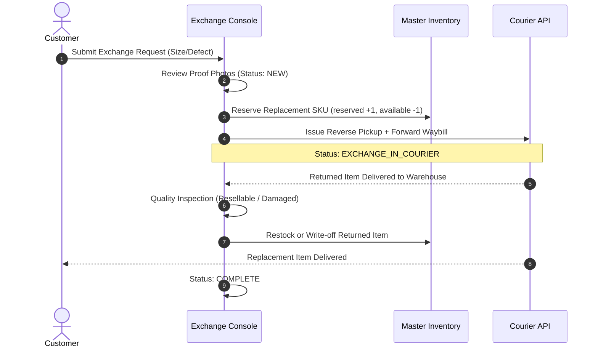
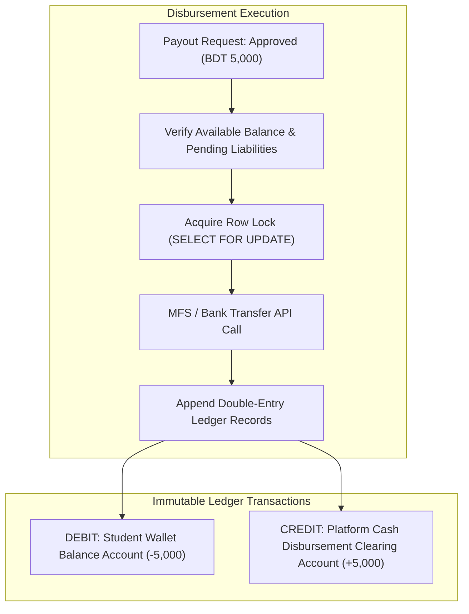
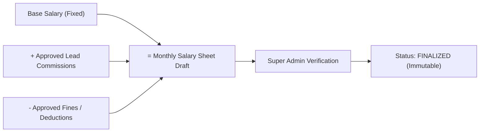

# Enterprise API Architecture & Implementation Plan (TDD Blueprint)

**Document ID:** API-ARCH-TDD-2026-V1  
**Target:** Institute Administration Portal Backend Services  
**Framework:** NestJS, Prisma ORM, PostgreSQL, Redis, Jest, Supertest  
**Methodology:** Strict Test-Driven Development (🔴 RED -> 🟢 GREEN -> 🔵 REFACTOR)  
**Related Documents:**
- [`docs/business_logic.md`](./business_logic.md)
- [`docs/admin_portal_task_plan.md`](./admin_portal_task_plan.md)
- [`docs/prd.md`](./prd.md)
- [`packages/db/prisma/schema.prisma`](../packages/db/prisma/schema.prisma)

---

## 1. Architectural Principles & TDD Lifecycle

This blueprint specifies the backend API architecture for all modules in the Institute Administration Portal. The platform handles multi-campus governance, high-velocity e-commerce fulfillment, financial ledger accounting, and external vendor procurement. 

### 1.1 The RED-GREEN-REFACTOR Protocol

Every endpoint, service method, and database transaction must be implemented following strict Test-Driven Development:

```mermaid
flowchart LR
    subgraph Phase1 ["1. RED Phase (🔴)"]
        R1["Write Unit / Integration Spec"]
        R2["Define DTOs & Invariants"]
        R3["Assert Security & RBAC Guards"]
        R4["Run Suite -> Confirm Expected Failure"]
    end

    subgraph Phase2 ["2. GREEN Phase (🟢)"]
        G1["Implement NestJS Controller/Service"]
        G2["Execute Atomic Prisma Transactions"]
        G3["Enforce Validation & Error Handling"]
        G4["Run Suite -> All Tests Pass"]
    end

    subgraph Phase3 ["3. REFACTOR Phase (🔵)"]
        B1["Optimize Complex SQL / CTEs"]
        B2["Add Database Indexing"]
        B3["Extract Shared Domain Logic"]
        B4["Verify Zero Regression"]
    end

    Phase1 --> Phase2 --> Phase3
```



1. **🔴 RED Phase:**
   - Define exact request DTOs with `class-validator` and response serialization contracts.
   - Write unit tests (`*.spec.ts`) mocking Prisma client and Redis services to verify business constraints, edge cases, and arithmetic precision.
   - Write E2E integration tests (`*.e2e-spec.ts`) utilizing Supertest against a dedicated PostgreSQL test container.
   - Verify tests fail with clear compilation or assertion errors (e.g., `404 Not Found`, `400 Bad Request`, `403 Forbidden`).

2. **🟢 GREEN Phase:**
   - Implement minimal, robust NestJS modules, controllers, providers, and database queries.
   - Enforce transactional consistency (`prisma.$transaction`) and deterministic state machines.
   - Ensure all assertions in the test suite pass with zero regressions.

3. **🔵 REFACTOR Phase:**
   - Eliminate redundant queries (N+1 issues) using batched joins or raw SQL Common Table Expressions (CTEs).
   - Ensure strict query timeouts and pagination bounds (`take <= 100`).
   - Add audit logging entries into system ledger and invalidate relevant Redis cache tags.

---

## 2. Core Data Policies & Security Invariants

### 2.1 Role-Based Access Control (RBAC) & Scope Matrix
Access control is enforced via `@UseGuards(JwtAuthGuard, RolesGuard)` and custom parameter decorators `@CampusScope()`:

| Module Domain | Minimum Permitted Role | Campus Isolation Policy | Sensitive Data Masking |
| :--- | :--- | :--- | :--- |
| **Students Governance** | `INSTITUTE_ADMIN`, `BRANCH_MANAGER` | Branch managers restricted to their assigned `branchId` | National ID (NID) redacted to last 4 digits except for KYC auditors |
| **Branches & Batches** | `SUPER_ADMIN`, `INSTITUTE_ADMIN` | Global view across all regional campuses | N/A |
| **Orders & Fulfillment** | `ORDER_MANAGER`, `INSTITUTE_ADMIN` | Campus hub filter applied based on fulfillment routing | Customer contact phone masked in transit reports |
| **Exchange Orders** | `ORDER_MANAGER`, `SUPPORT_AGENT` | Global order ledger with hub pickup assignments | Full audit trail on merchandise differential |
| **Seller Panel** | `SUPER_ADMIN`, `INSTITUTE_ADMIN` | Global platform vendor management | Trade license & TIN verified against registry |
| **Payments & Payouts** | `SUPER_ADMIN`, `INSTITUTE_ADMIN` | Centralized financial settlement | Bank account details encrypted with AES-256-GCM |
| **Purchases & Inventory** | `PRODUCT_MANAGER`, `INSTITUTE_ADMIN` | Multi-warehouse physical stock tracking | Landed cost concealed from external sellers |
| **Employees & Payroll** | `SUPER_ADMIN`, `INSTITUTE_ADMIN` | Branch managers see staff within their branch only | Base salary & penalty notes visible to Super Admin only |
| **Site Settings & CMS** | `SUPER_ADMIN` | Global platform parameters | API credentials & webhooks write-only |

### 2.2 Concurrency & Financial Integrity Policies
1. **Pessimistic Locking on Balance & Stock Mutations:**  
   Any transaction that updates physical inventory stock or wallet balances must acquire a row-level lock using PostgreSQL `FOR UPDATE`:
   ```sql
   SELECT id, on_hand, reserved FROM inventory_stocks WHERE product_id = $1 FOR UPDATE;
   ```
2. **Immutable Double-Entry Ledger Bookkeeping:**  
   All monetary and inventory movements create permanent append-only ledger entries. Deletions or updates to historical entries are strictly forbidden. Balance corrections require offsetting `ADJUSTMENT` transactions.
3. **Idempotency Keys:**  
   All mutation endpoints (`POST /api/finance/payouts/:id/disburse`, `POST /api/purchases`, `POST /api/exchanges`) require an `Idempotency-Key` HTTP header cached in Redis with a 24-hour TTL.

---

## 3. Module Specifications, Business Logic & TDD Test Plans

---

### Module 1: Students & Student Governance
**Navigation Targets:** `Pending Students`, `Registered Students`, `Cancel Students`, `Students Profit Payment`

#### Business Logic & State Transitions
- **KYC Verification Lifecycle:** `PENDING` -> `VERIFIED` | `REJECTED`. Verifying a student automatically transitions their enrolled store from `DRAFT` to `ACTIVE` if mandatory store setup is complete.
- **Store Suspension Cascade:** When a student is cancelled or suspended (`StoreStatus = SUSPENDED`):
  1. All active store products are atomically hidden from the storefront (`isVisible = false`).
  2. Active cart sessions referencing the store are invalidated.
  3. Pending payout requests are quarantined into `HOLD` status.
- **Profit Payment Calculation:**  
  Student net profit is derived strictly from fulfilled orders:
  $$\text{Net Profit} = \sum (\text{Selling Price} - \text{Base Price}) - \text{Platform Fee} - \text{Payment Fee} - \text{Refund Deductions}$$
  Disbursements are checked against minimum payout threshold (BDT 500) and verified bank/MFS KYC.

#### Complex Queries & Aggregations
- **Consolidated Student Performance Query:**
  ```sql
  SELECT 
    u.id, u.full_name, u.email, u.phone, u.is_verified,
    s.id AS store_id, s.store_name, s.status AS store_status,
    COALESCE(SUM(o.total_amount), 0) AS gross_sales,
    COALESCE(SUM(o.student_net_profit), 0) AS net_profit_earned,
    COALESCE((
      SELECT SUM(p.amount) FROM payout_requests p 
      WHERE p.student_id = u.id AND p.status = 'PROCESSED'
    ), 0) AS total_paid_out,
    COUNT(DISTINCT o.id) AS completed_orders_count
  FROM users u
  LEFT JOIN stores s ON s.student_id = u.id
  LEFT JOIN orders o ON o.store_id = s.id AND o.status = 'COMPLETE'
  WHERE u.role = 'STUDENT'
    AND ($1::text IS NULL OR u.is_verified = $1::boolean)
    AND ($2::text IS NULL OR s.status = $2::"StoreStatus")
    AND ($3::text IS NULL OR (u.full_name ILIKE $3 OR u.email ILIKE $3 OR u.phone ILIKE $3))
  GROUP BY u.id, s.id
  ORDER BY u.created_at DESC
  LIMIT $4 OFFSET $5;
  ```

#### TDD Suite Specification
- 🔴 **Unit Spec (`student-governance.service.spec.ts`):**
  - `verifyKyc()`: Should update `isVerified = true` and activate store.
  - `suspendStudent()`: Should set store to `SUSPENDED` and set all store products to `isVisible = false`.
  - `calculateNetProfit()`: Should throw `BadRequestException` if uncompleted orders are factored into profit.
- 🔴 **Integration Spec (`student-governance.e2e-spec.ts`):**
  - `PATCH /api/admin/students/:id/kyc`: Returns `200 OK` with updated profile when executed by `INSTITUTE_ADMIN`.
  - `PATCH /api/admin/students/:id/kyc`: Returns `403 Forbidden` when executed by `SELLER` or `STUDENT`.
  - `POST /api/admin/students/:id/suspend`: Verifies transactional atomicity; if product update fails, store suspension rollbacks.

---

### Module 2: Campus Branches
**Navigation Target:** `Branches`

#### Business Logic & State Transitions
- **Branch Types:** `PHYSICAL` (requires physical address, city, geo-coordinates) vs `DIGITAL` (virtual training hub).
- **Manager Assignment Integrity:** A user assigned as `managerId` must have role `BRANCH_MANAGER` or `INSTITUTE_ADMIN`. Reassigning a branch updates the previous manager's assignment log.
- **Deactivation Protection:** A branch cannot be deactivated if it contains active `StudentBatch` records in status `ACTIVE`.

#### Complex Queries & Aggregations
- **Branch Operational Metric Rollup:**
  ```sql
  SELECT 
    b.id, b.name, b.code, b.branch_type, b.city, b.is_active,
    u.full_name AS manager_name, u.phone AS manager_phone,
    COUNT(DISTINCT sb.id) AS total_batches,
    COUNT(DISTINCT be.student_id) FILTER (WHERE be.status = 'ENROLLED') AS active_students_count,
    COALESCE(SUM(o.total_amount), 0) AS total_revenue_generated
  FROM branches b
  LEFT JOIN users u ON b.manager_id = u.id
  LEFT JOIN student_batches sb ON sb.branch_id = b.id
  LEFT JOIN batch_enrollments be ON be.batch_id = sb.id
  LEFT JOIN stores s ON s.student_id = be.student_id
  LEFT JOIN orders o ON o.store_id = s.id AND o.status = 'COMPLETE'
  GROUP BY b.id, u.id
  ORDER BY b.created_at DESC;
  ```

#### TDD Suite Specification
- 🔴 **Unit Spec (`branches.service.spec.ts`):**
  - Should throw error if unique `code` already exists.
  - Should disallow deactivation when active batches exist.
- 🔴 **Integration Spec (`branches.e2e-spec.ts`):**
  - `POST /api/admin/branches`: Returns `201 Created` with sanitized branch entity.
  - `DELETE /api/admin/branches/:id`: Returns `409 Conflict` if dependent student enrollments exist.

---

### Module 3: Student Batches
**Navigation Target:** `Student Batches`

#### Business Logic & State Transitions
- **Batch State Machine:** `UPCOMING` -> `ACTIVE` -> `COMPLETED`.
- **Capacity Constraint:** Atomically prevent enrollment if `enrolledCount >= maxCapacity`.
- **Bulk Enrollment Transaction:** Enrolling 50+ students validates active student status and registers them inside a single database transaction.

#### Complex Queries & Aggregations
- **Batch Progress and Capacity Analytics:**
  ```sql
  SELECT 
    sb.id, sb.name, sb.batch_code, sb.start_date, sb.end_date, sb.max_capacity, sb.status,
    b.name AS branch_name,
    inst.full_name AS instructor_name,
    COUNT(be.id) AS enrolled_count,
    ROUND((COUNT(be.id)::decimal / sb.max_capacity) * 100, 1) AS occupancy_rate_percent,
    COUNT(be.id) FILTER (WHERE be.status = 'GRADUATED') AS graduated_count
  FROM student_batches sb
  LEFT JOIN branches b ON sb.branch_id = b.id
  LEFT JOIN users inst ON sb.instructor_id = inst.id
  LEFT JOIN batch_enrollments be ON be.batch_id = sb.id
  GROUP BY sb.id, b.id, inst.id;
  ```

#### TDD Suite Specification
- 🔴 **Unit Spec (`batches.service.spec.ts`):**
  - Concurrency test: 5 simultaneous enrollment requests when capacity is 1 must allow only 1 to succeed.
- 🔴 **Integration Spec (`batches.e2e-spec.ts`):**
  - `POST /api/admin/batches/:id/enroll`: Returns `400 Bad Request` if batch is `COMPLETED`.

---

### Module 4: Orders & Multi-Status Fulfillment Console
**Navigation Targets:** `Order Overview`, `All Orders`, `New Orders`, `Complete Orders`, `Partial Delivered`, `Unmatch Orders`, `Invoiced Orders`, `Hold Orders`, `Cancelled Orders`

#### Business Logic & 11-Status State Machine


- **UNMATCH Quarantine Logic:** Occurs when courier tracking number or SKU barcode scanned at warehouse does not match the invoice manifest. Order is frozen until supervisor reconciles items.
- **Partial Delivery Split:** When a customer accepts 2 of 3 items, the delivery driver logs the accepted items. The system automatically splits the order into an accepted invoice and issues a reverse return item manifest for the remaining item.

#### Complex Queries & Aggregations
- **Fast Queue Counter Aggregation (Single-Query Multi-Queue Scan):**
  ```sql
  SELECT 
    COUNT(*) AS total_all,
    COUNT(*) FILTER (WHERE status = 'NEW') AS queue_new,
    COUNT(*) FILTER (WHERE status = 'INVOICED') AS queue_invoiced,
    COUNT(*) FILTER (WHERE status = 'IN_COURIER') AS queue_in_courier,
    COUNT(*) FILTER (WHERE status = 'PARTIAL_DELIVERED') AS queue_partial,
    COUNT(*) FILTER (WHERE status = 'DELIVERED') AS queue_delivered,
    COUNT(*) FILTER (WHERE status = 'COMPLETE') AS queue_complete,
    COUNT(*) FILTER (WHERE status = 'HOLD') AS queue_hold,
    COUNT(*) FILTER (WHERE status = 'CANCELLED') AS queue_cancelled,
    COUNT(*) FILTER (WHERE status = 'UNMATCH') AS queue_unmatch,
    COUNT(*) FILTER (WHERE status = 'EXCHANGE') AS queue_exchange
  FROM orders;
  ```

#### TDD Suite Specification
- 🔴 **Unit Spec (`orders-fulfillment.service.spec.ts`):**
  - Verify invalid transition: `NEW -> COMPLETE` throws `IllegalStateTransitionException`.
  - Verify partial delivery recalculates subtotal and triggers ledger entry.
- 🔴 **Integration Spec (`orders-fulfillment.e2e-spec.ts`):**
  - `PATCH /api/orders/:id/status`: Transition to `INVOICED` generates unique invoice numbering sequence.
  - `POST /api/orders/bulk-invoice`: Invoicing 50 orders executes under 200ms using batched updates.

---

### Module 5: In Courier Tracking & 3PL Logistics
**Navigation Target:** `In Courier`

#### Business Logic & Logistics Webhooks
- **Supported Providers:** Steadfast, Pathao, RedX Express, Paperfly.
- **Webhook Idempotency:** Courier webhooks trigger updates on delivery state (`picked_up`, `in_transit`, `delivered`, `returned`). The webhook controller computes an HMAC-SHA256 signature and checks Redis for duplicate `delivery_event_id`.
- **RTO Handling:** When a courier marks an item as `RETURNED_TO_ORIGIN`, the warehouse receives an alert to scan the return parcel and verify product seal.

#### TDD Suite Specification
- 🔴 **Unit Spec (`courier-webhook.service.spec.ts`):**
  - Replayed webhooks with identical event IDs must return `200 OK` without re-executing database writes.
  - Invalid signature must trigger `UnauthorizedException`.

---

### Module 6: Exchange Orders Suite
**Navigation Targets:** `Exchange Overview`, `All Exchange Orders`, `New Exchange Orders`, `Complete Exchange Orders`, `Invoiced Exchange Orders`, `Hold Exchange Orders`, `Cancelled Exchange Orders`, `Exchange In Courier`

#### Business Logic & Two-Way Exchange Lifecycle


- **Price Differential Invoicing:** If the replacement item has a higher price, an invoice for the difference + return delivery fee is generated. If lower, a credit note is applied to the customer profile.
- **Stock Double-Reservation:** The replacement SKU must be held in `reserved` inventory upon exchange approval to prevent out-of-stock collisions.

#### Complex Queries & Aggregations
- **Exchange Lifecycle & Turnaround Metric Query:**
  ```sql
  SELECT 
    eo.id, eo.exchange_number, eo.reason, eo.status, eo.difference_amount,
    o.order_number AS original_order_number,
    c.full_name AS customer_name, c.phone AS customer_phone,
    eo.created_at,
    ROUND(EXTRACT(EPOCH FROM (COALESCE(eo.completed_at, NOW()) - eo.created_at)) / 86400, 1) AS days_in_process,
    p_orig.title AS returned_product_title,
    p_rep.title AS replacement_product_title
  FROM exchange_orders eo
  JOIN orders o ON eo.original_order_id = o.id
  JOIN customers c ON o.customer_id = c.id
  JOIN master_products p_orig ON eo.returned_product_id = p_orig.id
  JOIN master_products p_rep ON eo.replacement_product_id = p_rep.id
  WHERE ($1::text IS NULL OR eo.status = $1::"ExchangeStatus")
  ORDER BY eo.created_at DESC;
  ```

#### TDD Suite Specification
- 🔴 **Unit Spec (`exchange-orders.service.spec.ts`):**
  - Approving exchange on zero-stock SKU must throw `OutOfStockException`.
  - Rejection must release reserved replacement inventory.
- 🔴 **Integration Spec (`exchange-orders.e2e-spec.ts`):**
  - `POST /api/exchanges`: Creates exchange ticket, generates `#EX-YYYY-XXXX` sequence.
  - `PATCH /api/exchanges/:id/inspect`: Restocks item if `grading = RESELLABLE`.

---

### Module 7: External Seller Panel
**Navigation Targets:** `Overview`, `Seller List`, `Seller Adjustment`, `Support Tickets`, `Active Seller`

#### Business Logic & Vendor Operations
- **Seller Types:** `MERCHANT` (supplies products to student stores), `INSTRUCTOR` (creates courseware), `SUPPLIER` (procurement partner).
- **Manual Balance Adjustments:** Super Admin can issue `CREDIT` or `DEBIT` adjustments. Requires mandatory reason code, supporting document URL, and dual-admin authorization if amount exceeds BDT 10,000.
- **Vendor Scorecard Engine:** Automatically computed weekly based on:
  $$\text{Score} = (\text{On-Time Dispatch Rate} \times 0.4) + (\text{Product Quality Review Avg} \times 0.4) + (\text{Dispute Resolution Rate} \times 0.2)$$

#### TDD Suite Specification
- 🔴 **Unit Spec (`seller-governance.service.spec.ts`):**
  - Adjustment above threshold without second supervisor approval must remain `PENDING_APPROVAL`.
  - Deactivating seller profile cascades to unpublishing vendor items.

---

### Module 8: Payments & Settlements
**Navigation Targets:** `Payment Requests`, `Payment Paid`, `Payment Methods`

#### Business Logic & Double-Entry Ledger Engine


- **Zero-Balance Invariant:** A payout request cannot be disbursed if the student's `walletBalance - pendingWithdrawals < amount`.
- **Encryption of Secrets:** Payment gateway API credentials in `PaymentGatewayConfig` are stored as encrypted blobs using AES-256-GCM with environment-managed KMS keys.

#### TDD Suite Specification
- 🔴 **Unit Spec (`payout-disbursement.service.spec.ts`):**
  - Concurrent withdrawal attempts exceeding wallet balance must fail with `InsufficientFundsException`.
- 🔴 **Integration Spec (`payout-disbursement.e2e-spec.ts`):**
  - `POST /api/finance/payouts/:id/disburse`: Successfully appends ledger entry, returns transaction voucher.

---

### Module 9: Purchases & Procurement
**Navigation Targets:** `Add Purchase`, `Manage Purchase`, `Add Purchase Order`, `Manage Purchase Order`, `Purchase Return List`, `Purchase Return Type`

#### Business Logic & Three-Way Matching
- **Procurement Cycle:**
  1. Create PO (`DRAFT` -> `ISSUED` to supplier).
  2. Goods Received Note (GRN): Partial or full delivery received at warehouse. Physical inventory increases immediately.
  3. Invoice Matching: Supplier bill is matched against GRN unit quantities and agreed PO rates. Any variance greater than 1% triggers discrepancy review.
- **Weighted Average Cost (WAC) Update:**  
  When new stock is purchased at a different price:
  $$\text{New Base Cost} = \frac{(\text{Current Qty} \times \text{Current Cost}) + (\text{Purchased Qty} \times \text{Purchased Cost})}{\text{Current Qty} + \text{Purchased Qty}}$$

#### Complex Queries & Aggregations
- **Accounts Payable Aging Schedule:**
  ```sql
  SELECT 
    s.id AS supplier_id, s.name AS supplier_name,
    COALESCE(SUM(po.total_cost - po.paid_amount), 0) AS total_outstanding,
    COALESCE(SUM(po.total_cost - po.paid_amount) FILTER (WHERE po.created_at >= NOW() - INTERVAL '30 days'), 0) AS aging_0_30,
    COALESCE(SUM(po.total_cost - po.paid_amount) FILTER (WHERE po.created_at BETWEEN NOW() - INTERVAL '60 days' AND NOW() - INTERVAL '31 days'), 0) AS aging_31_60,
    COALESCE(SUM(po.total_cost - po.paid_amount) FILTER (WHERE po.created_at < NOW() - INTERVAL '60 days'), 0) AS aging_over_60
  FROM suppliers s
  JOIN purchase_orders po ON po.supplier_id = s.id AND po.status != 'CANCELLED'
  GROUP BY s.id;
  ```

#### TDD Suite Specification
- 🔴 **Unit Spec (`purchases.service.spec.ts`):**
  - Verify WAC recalculation formula on multi-unit purchase reception.
  - Return to supplier must deduct exact quantity from physical stock.

---

### Module 10: Products & Master Catalog Configuration
**Navigation Targets:** `Product`, `Categories`, `Subcategories`, `Sizes`, `Colors`, `Brands`

#### Business Logic & Product Taxonomy
- **Hierarchy Representation:** Multi-level categories use recursive adjacency lists with depth validation (max depth = 3 levels: Root -> Category -> Subcategory).
- **Variant Matrix Generation:** Creating a master product with sizes $[S, M, L]$ and colors $[Red, Blue]$ automatically generates 6 distinct SKUs with individual barcode tracking.
- **Cascade Safe Deletion:** A brand or category cannot be deleted if active master products are attached; it must be deactivated (`isActive = false`).

#### TDD Suite Specification
- 🔴 **Unit Spec (`catalog.service.spec.ts`):**
  - Circular category assignment (`Category A parent of B, B parent of A`) must throw `CircularDependencyException`.
  - Matrix generator must produce unique, collision-free variant SKUs.

---

### Module 11: Physical Inventory & Stock Ledger
**Navigation Targets:** `Stock`, `Ledger`, `Adjustments`

#### Business Logic & Stock Invariants
- **Stock Fields:**
  - `onHand`: Physical items inside warehouse.
  - `reserved`: Items committed to processing orders / exchanges.
  - `available`: Calculated as $\text{onHand} - \text{reserved}$.
- **Immutable Ledger:** Every stock change writes a record with `movementType` (`PURCHASE_RECEIPT`, `ORDER_FULFILLMENT`, `EXCHANGE_HOLD`, `RETURN_RESTOCK`, `AUDIT_ADJUSTMENT`) and records `balanceAfter`.

#### Complex Queries & Aggregations
- **Low Stock & Reorder Forecasting Query:**
  ```sql
  SELECT 
    mp.id, mp.sku, mp.title,
    c.name AS category_name,
    inv.on_hand, inv.reserved, (inv.on_hand - inv.reserved) AS available,
    inv.reorder_level,
    COALESCE(SUM(oi.quantity) FILTER (WHERE o.created_at >= NOW() - INTERVAL '30 days'), 0) AS sales_velocity_30d,
    ROUND(
      (inv.on_hand - inv.reserved)::decimal / 
      NULLIF(COALESCE(SUM(oi.quantity) FILTER (WHERE o.created_at >= NOW() - INTERVAL '30 days'), 0) / 30.0, 0),
      1
    ) AS days_of_stock_remaining
  FROM master_products mp
  JOIN categories c ON mp.category_id = c.id
  JOIN inventory_stocks inv ON inv.product_id = mp.id
  LEFT JOIN order_items oi ON oi.master_product_id = mp.id
  LEFT JOIN orders o ON oi.order_id = o.id AND o.status = 'COMPLETE'
  GROUP BY mp.id, c.name, inv.on_hand, inv.reserved, inv.reorder_level
  ORDER BY days_of_stock_remaining ASC;
  ```

#### TDD Suite Specification
- 🔴 **Unit Spec (`inventory.service.spec.ts`):**
  - Reserving stock when `available < orderQty` must fail with `InsufficientInventoryException`.
  - Manual adjustment must record supervisor `userId` and audit notes.

---

### Module 12: Operational Reports & Analytics
**Navigation Targets:** `Product Courier Status`, `Supplier Product Report`, `Supplier Profit Lifecycle`

#### Business Logic & Aggregation Caching
- **Heavy Query Optimization:** Queries spanning > 100,000 orders utilize PostgreSQL materialized views (`mv_daily_courier_stats`, `mv_supplier_lifecycle`) refreshed hourly via BullMQ worker jobs.
- **Supplier Profit Lifecycle:** Compares initial unit acquisition cost against actual selling price, minus return-to-origin loss and packaging cost over 90-day intervals.

#### TDD Suite Specification
- 🔴 **Unit Spec (`reports.service.spec.ts`):**
  - Verify division-by-zero protection on products with 0 units sold.
  - Materialized view refresh failure must fallback gracefully to read replica.

---

### Module 13: Wholesale B2B Operations
**Navigation Targets:** `Create Wholesale`, `Manage Wholesale`, `Product Wise Report`

#### Business Logic & B2B Rules
- **Tiered Volume Pricing:** Enforces bulk minimum order quantities (e.g. Min 50 units for 15% discount, Min 200 units for 25% discount).
- **Institutional Credit Management:** Checks enterprise customer credit limit before issuing order in `DISPATCHED` status without upfront payment.

#### TDD Suite Specification
- 🔴 **Unit Spec (`wholesale.service.spec.ts`):**
  - Ordering below tier minimum quantity rejects discount override.

---

### Module 14: Suppliers Directory
**Navigation Target:** `Suppliers`

#### Business Logic & Supplier Governance
- **Supplier Validation:** Enforces valid 12-digit Tax Identification Number (TIN) and verified business address.
- **Contract Tracking:** Warns administrators 30 days prior to supplier agreement expiration.

---

### Module 15: Site Settings & CMS
**Navigation Targets:** `General Setting`, `Manage Page`

#### Business Logic & Content Safety
- **Singleton Settings:** Guaranteed single active record for platform configuration.
- **HTML Sanitization:** Static page CMS content (`contentHtml`) is strictly sanitized with `DOMPurify` on backend ingestion to strip `<script>`, `<iframe>`, and malicious `onerror` attributes.

#### TDD Suite Specification
- 🔴 **Unit Spec (`cms.service.spec.ts`):**
  - Attempting to save `<script>alert('xss')</script>` must strip script tags before storage.

---

### Module 16: About Us Content
**Navigation Target:** `About Us`

#### Business Logic & Validation
- **Structured JSON Integrity:** Leadership team payload validates schema (`name`, `role`, `photoUrl`, `bio`, `linkedInUrl`). URLs must pass RFC 3986 format validation.

---

### Module 17: Employees, Commissions & Payroll
**Navigation Targets:** `Employee List`, `Add Employee`, `Lead Commissions`, `Fines / Penalties`, `Salary Sheet`

#### Business Logic & Payroll Disbursement Engine


- **Lead Commission Attribution:** Sales reps receive commissions upon order delivery. If an order is returned or cancelled, pending unapproved commissions are revoked.
- **Disciplinary Fines:** Must cite specific company policy infraction code and include supervisor approval notes.
- **Payroll Immutability:** Once a `SalarySheet` is approved and finalized, records are sealed; no further additions or deletions are permitted for that billing month.

#### Complex Queries & Aggregations
- **Monthly Payroll Matrix Aggregation Query:**
  ```sql
  SELECT 
    e.id AS employee_id,
    u.full_name, u.email,
    e.designation,
    b.name AS branch_name,
    e.base_salary,
    COALESCE((
      SELECT SUM(ec.amount) FROM employee_commissions ec 
      WHERE ec.employee_id = e.id AND ec.status = 'APPROVED'
        AND ec.created_at BETWEEN $1 AND $2
    ), 0) AS total_commissions,
    COALESCE((
      SELECT SUM(ep.amount) FROM employee_penalties ep 
      WHERE ep.employee_id = e.id AND ep.status = 'APPROVED'
        AND ep.effective_month = $3
    ), 0) AS total_penalties,
    (
      e.base_salary + 
      COALESCE((SELECT SUM(ec.amount) FROM employee_commissions ec WHERE ec.employee_id = e.id AND ec.status = 'APPROVED' AND ec.created_at BETWEEN $1 AND $2), 0) -
      COALESCE((SELECT SUM(ep.amount) FROM employee_penalties ep WHERE ep.employee_id = e.id AND ep.status = 'APPROVED' AND ep.effective_month = $3), 0)
    ) AS net_salary_payable
  FROM employees e
  JOIN users u ON e.user_id = u.id
  LEFT JOIN branches b ON e.branch_id = b.id
  WHERE e.is_active = true
  ORDER BY u.full_name ASC;
  ```

#### TDD Suite Specification
- 🔴 **Unit Spec (`payroll.service.spec.ts`):**
  - Verify net pay calculation accuracy: `Base (30,000) + Comm (5,000) - Penalty (2,000) = 33,000`.
  - Re-generating a finalized salary sheet throws `PayrollAlreadyFinalizedException`.

---

### Module 18: Storefront Banners
**Navigation Target:** `Banner`

#### Business Logic & Campaign Scheduling
- **Active Window Filter:** Only banners where `NOW() BETWEEN start_date AND end_date` and `is_active = true` are delivered to the storefront.
- **Sort Normalization:** Reordering banners executes inside an atomic integer reassignment transaction to eliminate sequence gaps.

---

### Module 19: FAQ Knowledge Base
**Navigation Target:** `Faq`

#### Business Logic & Search Vector
- **Full-Text Search:** Uses PostgreSQL `to_tsvector('english', question || ' ' || answer)` with GIN indexing for sub-5ms search responsiveness across support topics.

---

## 4. Test Execution & Coverage Mandate

To consider the API implementation complete, the test runner must satisfy the following thresholds:

| Metric | Target Minimum | Enforcement Mechanism |
| :--- | :--- | :--- |
| **Unit Test Coverage** | **90% Branch Coverage** | `jest --coverage --coverageThreshold='{"global":{"branches":90}}'` |
| **Integration Test Coverage** | **100% of REST Endpoints** | Supertest E2E suites covering Happy Path, Validation Failure, and RBAC Rejection |
| **Performance Benchmark** | **P95 < 120ms** | K6 load test on queue filtering and metric aggregation queries |
