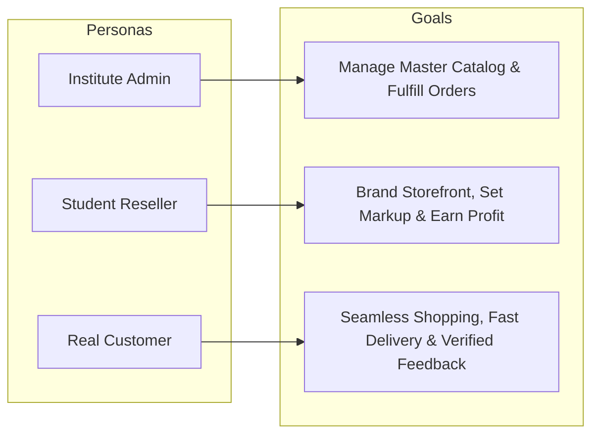
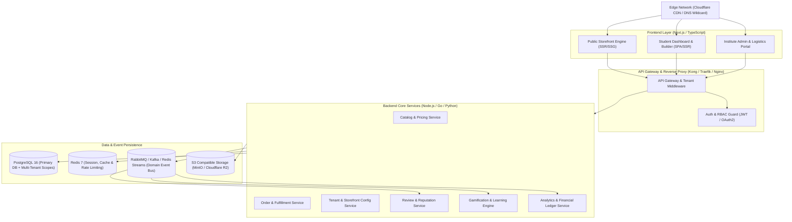
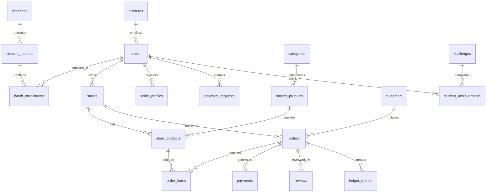
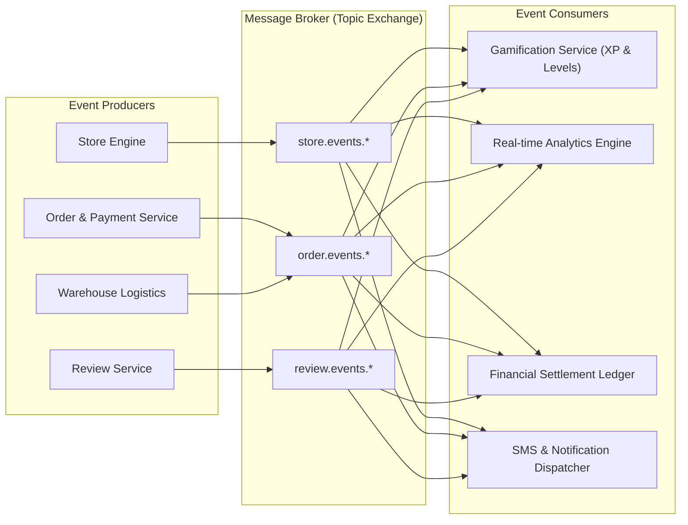
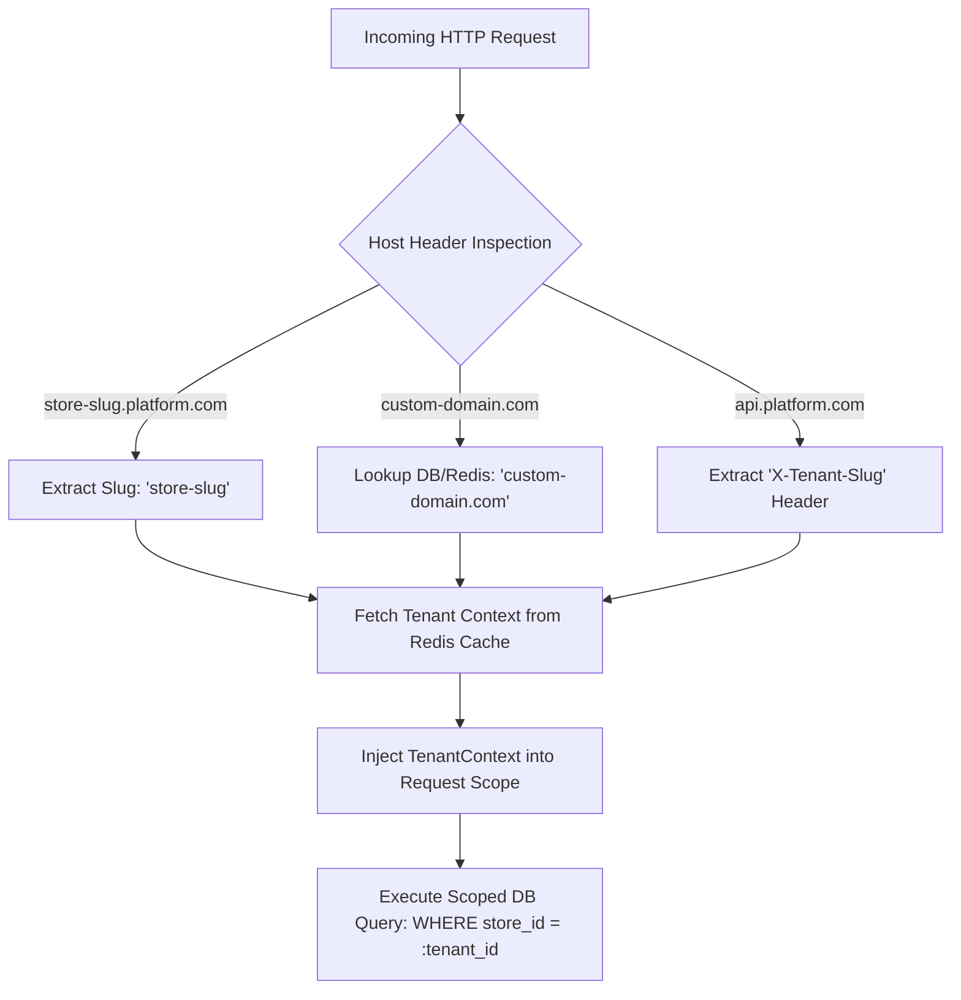
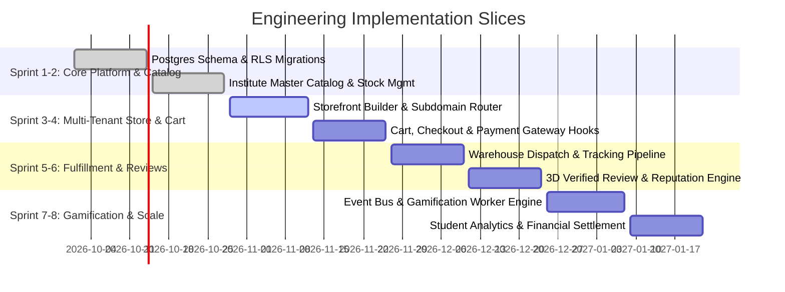

# Product Requirements Document (PRD): Code & System Architecture
**Project:** Commercial E-Commerce Reseller & Training Platform  
**Document ID:** PRD-ENG-2026-V1  
**Version:** 1.0.0  
**Status:** Ready for Implementation  
**Primary References:** [`docs/business_logic.md`](file:///media/shadhin/secandary/code/Are%20You%20read%20to%20sales/docs/business_logic.md), [`docs/requirement_analysis.md`](file:///media/shadhin/secandary/code/Are%20You%20read%20to%20sales/docs/requirement_analysis.md)  

---

## 1. Executive Summary & Product Objectives

### 1.1 Objective
The purpose of this platform is to provide a multi-tenant commercial e-commerce infrastructure where students operate real reseller stores, sell centrally supplied physical products to real customers, receive verified multi-dimensional ratings, and earn net profit while progressing through an automated, event-driven learning curriculum.

### 1.2 Target Performance & Success Metrics (KPIs)
- **Storefront Response Time (TTFB):** $< 200\text{ms}$ globally via Edge CDN.
- **API Latency:** P95 $< 150\text{ms}$ under standard load; P99 $< 300\text{ms}$.
- **Checkout Concurrency:** Zero inventory overselling across multi-storefront concurrent spikes up to 500 req/s.
- **Tenant Isolation Integrity:** 100% data partitioning across multi-tenant queries.
- **Event Processing Latency:** $< 500\text{ms}$ from domain event trigger to gamification/analytics update.

---

## 2. User Personas & Technical User Stories



### Epic 1: Tenant Store Engine & Storefront Customization
* **US-1.1 (Store Provisioning):** As a student, upon onboarding, I need the system to instantly provision a tenant record with a unique subdomain (`{store-slug}.platform.com`) so that my storefront is immediately accessible.
  * *Acceptance Criteria:* Subdomain routed via wildcard DNS; SSL certificate automatically active; default theme applied.
* **US-1.2 (Visual Customization):** As a student, I want to customize primary/secondary colors, typography, hero banners, and policy pages via a live preview editor so my store reflects my brand identity.
  * *Acceptance Criteria:* Theme configuration stored as structured JSON; validated against theme schema; live preview renders in $< 100\text{ms}$.
* **US-1.3 (Headless Storefront):** As a developer or advanced student, I want to consume REST/GraphQL Storefront APIs so that I can connect a custom Next.js/React or Mobile app frontend.
  * *Acceptance Criteria:* All public store data accessible via `/api/v1/stores/{slug}/*` with CORS and rate-limiting enabled.

### Epic 2: Central Catalog & Reseller Pricing Engine
* **US-2.1 (Product Import & Markup):** As a student, I want to browse the central marketplace, view wholesale base prices, and import products into my store with a custom selling price and marketing copy.
  * *Acceptance Criteria:* A `StoreProduct` record is created referencing `MasterProduct`; `selling_price >= base_price`; custom title and gallery override master defaults on the student's storefront.
* **US-2.2 (Inventory Sync & Lock):** As a platform operator, when master stock decreases, all student stores referencing that master product must reflect updated stock availability in real time.
  * *Acceptance Criteria:* Database transaction locks stock row during checkout; out-of-stock items reject cart conversion gracefully.

### Epic 3: Customer Checkout & Order Lifecycle
* **US-3.1 (Multi-Payment Checkout):** As a customer, I want to pay via MFS (bKash/Nagad), Credit/Debit Card, or Cash on Delivery (COD).
  * *Acceptance Criteria:* Webhook listener verifies gateway transactions; payment status updates order state to `PAID`; split-ledger ledger entries recorded.
* **US-3.2 (Warehouse Fulfillment):** As an order manager, I want to view all paid orders across all student stores in a centralized dashboard, print batch pick-lists, and dispatch couriers.
  * *Acceptance Criteria:* Updating state to `SHIPPED` inputs tracking number and triggers automated SMS/Email notification to the customer.

### Epic 4: 3D Customer Reviews & Verified Rating System
* **US-4.1 (Tri-Dimensional Ratings):** As a verified customer of a delivered order, I want to rate Product Quality, Store Service, and Delivery Speed separately.
  * *Acceptance Criteria:* Submission accepted only if `order.status == 'DELIVERED'` and `customer_id == order.customer_id`; reviews tagged with `is_verified = true`.
* **US-4.2 (Reputation Aggregation):** As a student, I want my store rating to update based only on Store Reviews, while Product Reviews update the global product catalog.
  * *Acceptance Criteria:* Asynchronous worker computes weighted rolling average and updates `stores.rating` and `master_products.rating`.

### Epic 5: Event-Driven Gamification & Training Architecture
* **US-5.1 (Automated Milestone Engine):** As a student, when my first order is delivered, I want the system to automatically mark "Challenge: First Successful Sale" as completed and award level XP.
  * *Acceptance Criteria:* `OrderDelivered` event consumed by Gamification Service; student progress record updated idempotently; notification dispatched to student dashboard.
* **US-5.2 (Operational Recommendations):** As a student, if my cart-to-checkout dropoff exceeds 80%, I want the dashboard to suggest actionable conversion optimization tips.
  * *Acceptance Criteria:* Rule engine evaluates analytics rollup nightly and generates prescriptive feedback cards.

### Epic 6: Unified Admin Operations Portal & Governance
* **US-6.1 (Executive Dashboard & Real-Time Alerts):** As an institute executive, I want an executive overview panel with real-time GMV, conversion metrics, and a high-priority notification bubble (`01`) indicating urgent operational tasks.
  * *Acceptance Criteria:* Dashboard aggregates cross-store GMV, active stores, order pipeline volume; alert badge displays real-time unread/urgent operational actions.
* **US-6.2 (Student Governance Suite):** As an administrator, I want an expandable Students navigation menu to review student profiles, verify KYC documentation, monitor student records, and apply account suspensions with audit logs.
  * *Acceptance Criteria:* Searchable student directory, document verification workflow, one-click store suspension toggling storefront visibility with audit reasons.
* **US-6.3 (Campus & Branch Operations):** As an operations director, I want to manage physical and digital campus branches, assign branch managers, and associate regional warehouse hubs.
  * *Acceptance Criteria:* Branch CRUD, manager assignment, regional delivery zone linking, and branch-wise revenue/enrollment analytics.
* **US-6.4 (Student Batches & Cohort Scheduling):** As an academic lead, I want to organize students into batches/classes, configure capacity and schedules, assign mentors, and benchmark cohort performance.
  * *Acceptance Criteria:* Batch creation with start/end dates, student enrollment mapping, batch mentor assignment, and cohort commercial sales leaderboards.
* **US-6.5 (Granular Order Operations & Multi-Queue Fulfillment):** As an order manager, I want an expanded Orders section supporting 11 distinct operational queues (Order Overview, All Orders [9410], New Orders [8], Complete Orders [0], Partial Delivered [233], Unmatch Orders [4035], Invoiced Orders [8778], Hold Orders [29], Cancelled Orders [131], In Courier [9243], Exchange Orders).
  * *Acceptance Criteria:* Real-time order volume counters per status tab; batch invoice generation; barcode scan discrepancy quarantine (`UNMATCH`); 3PL courier sync (`IN_COURIER`); item/course swap workflow (`EXCHANGE`).
* **US-6.6 (External Seller Panel & Merchant Governance):** As a platform operator, I want to onboard external merchants and instructors, set wholesale prices and commission splits, and audit seller scorecards.
  * *Acceptance Criteria:* Seller profile management, catalog publishing permissions, commission rate configuration, and defect/fulfillment SLA monitoring.
* **US-6.7 (Financial Payment Requests & Settlement):** As a financial controller, I want a dedicated payment request queue showing pending requests (badge indicator `3`), automated ledger balance verification, and approval/rejection workflows with external transaction references.
  * *Acceptance Criteria:* Requests validate against available cleared balance; approve step requires transaction reference (bKash/Nagad/Bank TrxID); rejection notes reason and unlocks held funds.

---

## 3. Recommended Technology Stack & Architecture



### 3.1 Tech Stack Summary
- **Backend Framework:** Node.js (NestJS / Express + TypeScript) or Go (Gin / Fiber) or Python (FastAPI).
- **Frontend Framework:** Next.js 14+ (App Router, TailwindCSS, Shadcn/UI, Zustand).
- **Primary Database:** PostgreSQL 16 with Row-Level Security (RLS) or tenant-scoped ORM queries.
- **Cache & In-Memory Store:** Redis 7 (Cart sessions, rate limiting, leaderboards).
- **Message Broker:** RabbitMQ / Redis Streams for asynchronous domain events.
- **File Storage:** S3 / Cloudflare R2 (Product images, store logos, banner assets).
- **Payment Gateways:** SSLCommerz / bKash / Nagad / Stripe (Multi-currency & Local MFS).

---

## 4. Database Schema Design (PostgreSQL DDL Specification)



### 4.1 Schema Definition (PostgreSQL 16)

```sql
-- Enable UUID extension
CREATE EXTENSION IF NOT EXISTS "uuid-ossp";

-- 1. Users & RBAC
CREATE TYPE user_role AS ENUM (
    'SUPER_ADMIN', 'INSTITUTE_ADMIN', 'BRANCH_MANAGER', 'PRODUCT_MANAGER', 
    'ORDER_MANAGER', 'TRAINING_MANAGER', 'SUPPORT_AGENT', 'SELLER', 'STUDENT'
);

CREATE TABLE users (
    id UUID PRIMARY KEY DEFAULT uuid_generate_v4(),
    email VARCHAR(255) UNIQUE NOT NULL,
    password_hash VARCHAR(255) NOT NULL,
    full_name VARCHAR(150) NOT NULL,
    phone VARCHAR(30),
    role user_role NOT NULL DEFAULT 'STUDENT',
    is_active BOOLEAN NOT NULL DEFAULT TRUE,
    created_at TIMESTAMPTZ NOT NULL DEFAULT NOW(),
    updated_at TIMESTAMPTZ NOT NULL DEFAULT NOW()
);

-- 2. Student Stores (Multi-Tenancy)
CREATE TYPE store_status AS ENUM ('DRAFT', 'ACTIVE', 'SUSPENDED', 'MAINTENANCE');

CREATE TABLE stores (
    id UUID PRIMARY KEY DEFAULT uuid_generate_v4(),
    student_id UUID NOT NULL REFERENCES users(id) ON DELETE RESTRICT,
    store_name VARCHAR(100) NOT NULL,
    slug VARCHAR(60) UNIQUE NOT NULL, -- Subdomain key: {slug}.platform.com
    custom_domain VARCHAR(255) UNIQUE,
    logo_url TEXT,
    favicon_url TEXT,
    theme_config JSONB NOT NULL DEFAULT '{
        "primaryColor": "#2563eb",
        "secondaryColor": "#1e293b",
        "fontFamily": "Inter",
        "borderRadius": "8px"
    }',
    branding_info JSONB NOT NULL DEFAULT '{
        "tagline": "",
        "bio": "",
        "contactEmail": "",
        "contactPhone": "",
        "socials": {}
    }',
    status store_status NOT NULL DEFAULT 'DRAFT',
    rating_avg NUMERIC(3, 2) NOT NULL DEFAULT 5.00,
    total_reviews_count INT NOT NULL DEFAULT 0,
    created_at TIMESTAMPTZ NOT NULL DEFAULT NOW(),
    updated_at TIMESTAMPTZ NOT NULL DEFAULT NOW()
);

CREATE INDEX idx_stores_slug ON stores(slug);
CREATE INDEX idx_stores_student_id ON stores(student_id);

-- 3. Categories & Central Master Catalog
CREATE TABLE categories (
    id UUID PRIMARY KEY DEFAULT uuid_generate_v4(),
    name VARCHAR(100) NOT NULL,
    slug VARCHAR(100) UNIQUE NOT NULL,
    parent_id UUID REFERENCES categories(id) ON DELETE SET NULL,
    created_at TIMESTAMPTZ NOT NULL DEFAULT NOW()
);

CREATE TABLE master_products (
    id UUID PRIMARY KEY DEFAULT uuid_generate_v4(),
    sku VARCHAR(64) UNIQUE NOT NULL,
    title VARCHAR(255) NOT NULL,
    category_id UUID REFERENCES categories(id) ON DELETE RESTRICT,
    base_price NUMERIC(12, 2) NOT NULL CHECK (base_price >= 0),
    stock_quantity INT NOT NULL DEFAULT 0 CHECK (stock_quantity >= 0),
    master_description TEXT,
    master_images TEXT[] NOT NULL DEFAULT '{}',
    is_active BOOLEAN NOT NULL DEFAULT TRUE,
    rating_avg NUMERIC(3, 2) NOT NULL DEFAULT 5.00,
    total_reviews_count INT NOT NULL DEFAULT 0,
    created_at TIMESTAMPTZ NOT NULL DEFAULT NOW(),
    updated_at TIMESTAMPTZ NOT NULL DEFAULT NOW()
);

CREATE INDEX idx_master_products_sku ON master_products(sku);
CREATE INDEX idx_master_products_category ON master_products(category_id);

-- 4. Student Store Product Customization
CREATE TABLE store_products (
    id UUID PRIMARY KEY DEFAULT uuid_generate_v4(),
    store_id UUID NOT NULL REFERENCES stores(id) ON DELETE CASCADE,
    master_product_id UUID NOT NULL REFERENCES master_products(id) ON DELETE RESTRICT,
    selling_price NUMERIC(12, 2) NOT NULL,
    compare_at_price NUMERIC(12, 2),
    custom_title VARCHAR(255),
    custom_description TEXT,
    custom_images TEXT[] DEFAULT '{}',
    tags VARCHAR(50)[] DEFAULT '{}',
    is_featured BOOLEAN NOT NULL DEFAULT FALSE,
    is_visible BOOLEAN NOT NULL DEFAULT TRUE,
    created_at TIMESTAMPTZ NOT NULL DEFAULT NOW(),
    updated_at TIMESTAMPTZ NOT NULL DEFAULT NOW(),
    CONSTRAINT uq_store_product UNIQUE (store_id, master_product_id)
);

CREATE INDEX idx_store_products_store ON store_products(store_id);

-- 5. Customers & CRM
CREATE TABLE customers (
    id UUID PRIMARY KEY DEFAULT uuid_generate_v4(),
    store_id UUID NOT NULL REFERENCES stores(id) ON DELETE CASCADE,
    full_name VARCHAR(150) NOT NULL,
    phone VARCHAR(30) NOT NULL,
    email VARCHAR(255),
    addresses JSONB NOT NULL DEFAULT '[]',
    total_orders_count INT NOT NULL DEFAULT 0,
    total_spend NUMERIC(12, 2) NOT NULL DEFAULT 0.00,
    created_at TIMESTAMPTZ NOT NULL DEFAULT NOW(),
    updated_at TIMESTAMPTZ NOT NULL DEFAULT NOW(),
    CONSTRAINT uq_store_customer_phone UNIQUE (store_id, phone)
);

CREATE INDEX idx_customers_store ON customers(store_id);

-- 6. Orders & Order Items
CREATE TYPE order_status AS ENUM (
    'NEW',                  -- Incoming unprocessed orders (e.g. 8)
    'INVOICED',             -- Bills generated, pick-pack ready (e.g. 8778)
    'IN_COURIER',           -- In transit with 3PL logistics (e.g. 9243)
    'PARTIAL_DELIVERED',    -- Partial split bundle delivered (e.g. 233)
    'DELIVERED',            -- Consignment delivered to customer
    'COMPLETE',             -- Return window expired & settlement locked (e.g. 0)
    'HOLD',                 -- Paused for customer confirmation / stock replenishment (e.g. 29)
    'CANCELLED',            -- Terminated order with stock restored (e.g. 131)
    'UNMATCH',              -- Quarantined for SKU, barcode, or payment discrepancy (e.g. 4035)
    'EXCHANGE',             -- Item or course replacement workflow
    'RETURNED',             -- Returned to warehouse
    'REFUNDED'              -- Payment refunded and ledger reversed
);

CREATE TABLE orders (
    id UUID PRIMARY KEY DEFAULT uuid_generate_v4(),
    store_id UUID NOT NULL REFERENCES stores(id) ON DELETE RESTRICT,
    customer_id UUID NOT NULL REFERENCES customers(id) ON DELETE RESTRICT,
    order_number VARCHAR(64) UNIQUE NOT NULL,
    subtotal NUMERIC(12, 2) NOT NULL,
    shipping_fee NUMERIC(12, 2) NOT NULL DEFAULT 0.00,
    discount_amount NUMERIC(12, 2) NOT NULL DEFAULT 0.00,
    total_amount NUMERIC(12, 2) NOT NULL,
    
    -- Split Financials
    total_base_cost NUMERIC(12, 2) NOT NULL,
    platform_commission NUMERIC(12, 2) NOT NULL DEFAULT 0.00,
    payment_fee NUMERIC(12, 2) NOT NULL DEFAULT 0.00,
    student_net_profit NUMERIC(12, 2) NOT NULL,
    
    status order_status NOT NULL DEFAULT 'PENDING_PAYMENT',
    payment_method VARCHAR(50) NOT NULL, -- 'BKASH', 'CARD', 'COD'
    payment_status VARCHAR(50) NOT NULL DEFAULT 'UNPAID',
    shipping_address JSONB NOT NULL,
    tracking_number VARCHAR(100),
    courier_name VARCHAR(100),
    created_at TIMESTAMPTZ NOT NULL DEFAULT NOW(),
    updated_at TIMESTAMPTZ NOT NULL DEFAULT NOW()
);

CREATE INDEX idx_orders_store ON orders(store_id);
CREATE INDEX idx_orders_customer ON orders(customer_id);
CREATE INDEX idx_orders_status ON orders(status);

CREATE TABLE order_items (
    id UUID PRIMARY KEY DEFAULT uuid_generate_v4(),
    order_id UUID NOT NULL REFERENCES orders(id) ON DELETE CASCADE,
    store_product_id UUID REFERENCES store_products(id) ON DELETE SET NULL,
    master_product_id UUID NOT NULL REFERENCES master_products(id) ON DELETE RESTRICT,
    quantity INT NOT NULL CHECK (quantity > 0),
    unit_base_price NUMERIC(12, 2) NOT NULL,
    unit_selling_price NUMERIC(12, 2) NOT NULL,
    total_price NUMERIC(12, 2) NOT NULL
);

-- 7. Multi-Dimensional Customer Reviews
CREATE TABLE reviews (
    id UUID PRIMARY KEY DEFAULT uuid_generate_v4(),
    order_id UUID NOT NULL REFERENCES orders(id) ON DELETE RESTRICT,
    master_product_id UUID NOT NULL REFERENCES master_products(id) ON DELETE RESTRICT,
    store_id UUID NOT NULL REFERENCES stores(id) ON DELETE RESTRICT,
    customer_id UUID NOT NULL REFERENCES customers(id) ON DELETE RESTRICT,
    
    product_rating SMALLINT NOT NULL CHECK (product_rating BETWEEN 1 AND 5),
    store_rating SMALLINT NOT NULL CHECK (store_rating BETWEEN 1 AND 5),
    delivery_rating SMALLINT NOT NULL CHECK (delivery_rating BETWEEN 1 AND 5),
    
    product_comment TEXT,
    store_comment TEXT,
    delivery_comment TEXT,
    is_verified BOOLEAN NOT NULL DEFAULT TRUE,
    created_at TIMESTAMPTZ NOT NULL DEFAULT NOW(),
    CONSTRAINT uq_order_review UNIQUE (order_id, master_product_id)
);

CREATE INDEX idx_reviews_master_product ON reviews(master_product_id);
CREATE INDEX idx_reviews_store ON reviews(store_id);

-- 8. Gamification & Learning Progress
CREATE TABLE challenges (
    id UUID PRIMARY KEY DEFAULT uuid_generate_v4(),
    code VARCHAR(50) UNIQUE NOT NULL, -- e.g., 'CH_FIRST_SALE'
    title VARCHAR(150) NOT NULL,
    description TEXT NOT NULL,
    required_event VARCHAR(100) NOT NULL, -- e.g., 'ORDER_DELIVERED'
    threshold INT NOT NULL DEFAULT 1,
    tier_level INT NOT NULL DEFAULT 1,
    xp_reward INT NOT NULL DEFAULT 100
);

CREATE TABLE student_progress (
    id UUID PRIMARY KEY DEFAULT uuid_generate_v4(),
    student_id UUID NOT NULL REFERENCES users(id) ON DELETE CASCADE,
    challenge_id UUID NOT NULL REFERENCES challenges(id) ON DELETE CASCADE,
    current_count INT NOT NULL DEFAULT 0,
    is_completed BOOLEAN NOT NULL DEFAULT FALSE,
    completed_at TIMESTAMPTZ,
    CONSTRAINT uq_student_challenge UNIQUE (student_id, challenge_id)
);

CREATE TABLE student_levels (
    student_id UUID PRIMARY KEY REFERENCES users(id) ON DELETE CASCADE,
    current_level INT NOT NULL DEFAULT 1,
    total_xp INT NOT NULL DEFAULT 0,
    level_title VARCHAR(100) NOT NULL DEFAULT 'Store Starter',
    updated_at TIMESTAMPTZ NOT NULL DEFAULT NOW()
);

-- 9. Financial Ledger & Payout Balances
CREATE TABLE ledger_entries (
    id UUID PRIMARY KEY DEFAULT uuid_generate_v4(),
    store_id UUID NOT NULL REFERENCES stores(id) ON DELETE RESTRICT,
    order_id UUID REFERENCES orders(id) ON DELETE SET NULL,
    entry_type VARCHAR(50) NOT NULL, -- 'ORDER_PROFIT', 'PLATFORM_FEE', 'PAYOUT_WITHDRAWAL'
    amount NUMERIC(12, 2) NOT NULL,
    balance_after NUMERIC(12, 2) NOT NULL,
    notes TEXT,
    created_at TIMESTAMPTZ NOT NULL DEFAULT NOW()
);

-- 10. Campus Branches & Regional Locations
CREATE TABLE branches (
    id UUID PRIMARY KEY DEFAULT uuid_generate_v4(),
    name VARCHAR(150) NOT NULL,
    code VARCHAR(50) UNIQUE NOT NULL, -- e.g. 'DHK-MAIN', 'CTG-HUB', 'VIRTUAL'
    branch_type VARCHAR(30) NOT NULL DEFAULT 'PHYSICAL', -- 'PHYSICAL', 'DIGITAL'
    address TEXT,
    city VARCHAR(100),
    contact_phone VARCHAR(30),
    contact_email VARCHAR(255),
    manager_id UUID REFERENCES users(id) ON DELETE SET NULL,
    is_active BOOLEAN NOT NULL DEFAULT TRUE,
    created_at TIMESTAMPTZ NOT NULL DEFAULT NOW(),
    updated_at TIMESTAMPTZ NOT NULL DEFAULT NOW()
);

-- 11. Student Batches & Cohort Organization
CREATE TABLE student_batches (
    id UUID PRIMARY KEY DEFAULT uuid_generate_v4(),
    branch_id UUID REFERENCES branches(id) ON DELETE SET NULL,
    name VARCHAR(150) NOT NULL,
    batch_code VARCHAR(60) UNIQUE NOT NULL, -- e.g. 'BATCH-2026-A'
    instructor_id UUID REFERENCES users(id) ON DELETE SET NULL,
    start_date DATE NOT NULL,
    end_date DATE,
    max_capacity INT NOT NULL DEFAULT 50,
    status VARCHAR(30) NOT NULL DEFAULT 'ACTIVE', -- 'UPCOMING', 'ACTIVE', 'COMPLETED'
    created_at TIMESTAMPTZ NOT NULL DEFAULT NOW(),
    updated_at TIMESTAMPTZ NOT NULL DEFAULT NOW()
);

CREATE TABLE batch_enrollments (
    id UUID PRIMARY KEY DEFAULT uuid_generate_v4(),
    batch_id UUID NOT NULL REFERENCES student_batches(id) ON DELETE CASCADE,
    student_id UUID NOT NULL REFERENCES users(id) ON DELETE CASCADE,
    status VARCHAR(30) NOT NULL DEFAULT 'ENROLLED', -- 'ENROLLED', 'GRADUATED', 'DROPPED'
    enrolled_at TIMESTAMPTZ NOT NULL DEFAULT NOW(),
    CONSTRAINT uq_batch_student UNIQUE (batch_id, student_id)
);

CREATE INDEX idx_batch_enrollments_student ON batch_enrollments(student_id);

-- 12. External Sellers & Merchants
CREATE TABLE seller_profiles (
    id UUID PRIMARY KEY DEFAULT uuid_generate_v4(),
    user_id UUID UNIQUE NOT NULL REFERENCES users(id) ON DELETE CASCADE,
    company_name VARCHAR(200) NOT NULL,
    seller_type VARCHAR(50) NOT NULL DEFAULT 'MERCHANT', -- 'MERCHANT', 'INSTRUCTOR', 'SUPPLIER'
    trade_license_number VARCHAR(100),
    tin_bin_number VARCHAR(100),
    commission_rate NUMERIC(5, 2) NOT NULL DEFAULT 5.00,
    compliance_score NUMERIC(4, 2) NOT NULL DEFAULT 100.00,
    status VARCHAR(30) NOT NULL DEFAULT 'PENDING', -- 'PENDING', 'APPROVED', 'SUSPENDED'
    created_at TIMESTAMPTZ NOT NULL DEFAULT NOW(),
    updated_at TIMESTAMPTZ NOT NULL DEFAULT NOW()
);

-- 13. Financial Payment Requests
CREATE TABLE payment_requests (
    id UUID PRIMARY KEY DEFAULT uuid_generate_v4(),
    user_id UUID NOT NULL REFERENCES users(id) ON DELETE RESTRICT,
    store_id UUID REFERENCES stores(id) ON DELETE SET NULL,
    amount NUMERIC(12, 2) NOT NULL CHECK (amount > 0),
    payment_method VARCHAR(50) NOT NULL, -- 'BKASH', 'NAGAD', 'BANK_TRANSFER'
    account_details JSONB NOT NULL,
    status VARCHAR(30) NOT NULL DEFAULT 'PENDING', -- 'PENDING', 'APPROVED', 'REJECTED', 'SETTLED'
    transaction_reference VARCHAR(150),
    rejection_reason TEXT,
    reviewed_by_id UUID REFERENCES users(id) ON DELETE SET NULL,
    requested_at TIMESTAMPTZ NOT NULL DEFAULT NOW(),
    settled_at TIMESTAMPTZ
);

CREATE INDEX idx_payment_requests_status ON payment_requests(status);
CREATE INDEX idx_payment_requests_user ON payment_requests(user_id);
```

---

## 5. API Contracts & Technical Specifications

```mermaid
sequenceDiagram
    autonumber
    actor Customer
    participant API as Storefront Gateway
    participant OrderService
    participant DB as Postgres (TX Lock)
    participant Bus as Event Bus

    Customer->>API: POST /api/v1/stores/{slug}/checkout
    API->>OrderService: Validate Cart & Stock
    OrderService->>DB: BEGIN TX; SELECT stock FOR UPDATE;
    alt Stock Available
        DB-->>OrderService: Stock Confirmed & Decremented
        OrderService->>DB: INSERT orders, order_items, ledger_pending; COMMIT TX;
        OrderService-->>API: 201 Created (Payment Redirect URL)
        API-->>Customer: Redirect to Gateway
    else Insufficient Stock
        DB-->>OrderService: Rollback TX
        OrderService-->>API: 409 Conflict ("Out of Stock")
        API-->>Customer: Error notification
    end
```

### 5.1 Public Storefront Endpoints (Headless)
All public endpoints resolve the tenant from either `{slug}` path parameter or `X-Tenant-Slug` / `Host` HTTP headers.

#### 1. Retrieve Storefront Metadata & Theme
- **`GET /api/v1/stores/{slug}/meta`**
- **Response `200 OK`:**
```json
{
  "storeId": "9b1deb4d-3b7d-4bad-9bdd-2b0d7b3dcb6d",
  "storeName": "Apex Fashion Zone",
  "slug": "apexfashion",
  "customDomain": null,
  "theme": {
    "primaryColor": "#10b981",
    "secondaryColor": "#0f172a",
    "fontFamily": "Inter",
    "borderRadius": "8px"
  },
  "branding": {
    "tagline": "Premium Quality Gear",
    "logoUrl": "https://assets.platform.com/stores/apexfashion/logo.png",
    "socials": { "facebook": "https://fb.com/apex", "instagram": "@apexfashion" }
  },
  "rating": 4.85,
  "reviewCount": 94
}
```

#### 2. Get Store Products (Paginated & Filtered)
- **`GET /api/v1/stores/{slug}/products?page=1&limit=20&category=accessories&sort=price_asc`**
- **Response `200 OK`:**
```json
{
  "data": [
    {
      "storeProductId": "7d648b28-1122-4861-9c60-a23bfdf18844",
      "masterProductId": "23c21a4f-56bb-49e3-82dc-98a96e952671",
      "title": "Minimalist Leather Backpack",
      "sellingPrice": 1450.00,
      "compareAtPrice": 1800.00,
      "images": [
        "https://assets.platform.com/products/leather-bag-1.jpg"
      ],
      "inStock": true,
      "availableQuantity": 42,
      "rating": 4.9,
      "reviewCount": 38
    }
  ],
  "pagination": { "currentPage": 1, "totalPages": 3, "totalRecords": 45 }
}
```

#### 3. Submit Customer Checkout
- **`POST /api/v1/stores/{slug}/checkout`**
- **Request Body:**
```json
{
  "customer": {
    "fullName": "Rahim Ahmed",
    "phone": "+8801700000000",
    "email": "rahim@example.com",
    "address": {
      "street": "House 12, Road 4, Dhanmondi",
      "city": "Dhaka",
      "postalCode": "1205"
    }
  },
  "items": [
    { "storeProductId": "7d648b28-1122-4861-9c60-a23bfdf18844", "quantity": 1 }
  ],
  "paymentMethod": "BKASH",
  "couponCode": "WELCOME10"
}
```
- **Response `201 Created`:**
```json
{
  "orderNumber": "ORD-2026-98124",
  "totalAmount": 1400.00,
  "paymentStatus": "PENDING",
  "paymentGatewayUrl": "https://payment.platform.com/checkout/sess_8912739812"
}
```

#### 4. Submit Tri-Dimensional Customer Review
- **`POST /api/v1/stores/{slug}/reviews`**
- **Request Body:**
```json
{
  "orderNumber": "ORD-2026-98124",
  "customerPhone": "+8801700000000",
  "masterProductId": "23c21a4f-56bb-49e3-82dc-98a96e952671",
  "productRating": 5,
  "productComment": "Exceptional leather finish and sturdy stitching.",
  "storeRating": 5,
  "storeComment": "Quick order confirmation and helpful support.",
  "deliveryRating": 4,
  "deliveryComment": "Delivered within 48 hours."
}
```

### 5.2 Admin Portal Operations & Governance Endpoints

All admin endpoints require an authenticated JWT bearing an administrative role (`SUPER_ADMIN`, `INSTITUTE_ADMIN`, `BRANCH_MANAGER`, `ORDER_MANAGER`, etc.) and enforce dynamic permission guards.

#### 1. Executive Dashboard & Urgent Alerts
- **`GET /api/v1/admin/dashboard/overview`**
- **Response `200 OK`:**
```json
{
  "urgentAlertsCount": 1,
  "alerts": [
    {
      "id": "alert-01",
      "severity": "HIGH",
      "title": "Pending Payout Requests",
      "message": "3 student withdrawal requests awaiting verification > 24 hours.",
      "actionRoute": "/finance/payouts"
    }
  ],
  "metrics": {
    "totalGmv": 14258900.00,
    "platformNetRevenue": 1140712.00,
    "activeStoresCount": 412,
    "totalStudents": 1250,
    "todayOrdersCount": 184
  }
}
```

#### 2. Expandable Student Governance API
- **`GET /api/v1/admin/students?page=1&limit=25&search=Rahim&status=ACTIVE&branchId=...`**
- **`GET /api/v1/admin/students/:id`** (Returns profile, KYC docs, enrolled batches, linked store metrics)
- **`PATCH /api/v1/admin/students/:id/status`**
  - **Body:** `{ "status": "SUSPENDED", "reason": "Violation of merchant branding policy", "notifyStudent": true }`

#### 3. Campus Branches Management
- **`GET /api/v1/admin/branches`**
- **`POST /api/v1/admin/branches`**
  - **Body:** `{ "name": "Chittagong Regional Hub", "code": "CTG-HUB", "branchType": "PHYSICAL", "address": "Agrabad C/A", "city": "Chittagong", "managerId": "user-uuid" }`
- **`PUT /api/v1/admin/branches/:id`**

#### 4. Student Batches & Cohort Scheduling
- **`GET /api/v1/admin/batches?branchId=...&status=ACTIVE`**
- **`POST /api/v1/admin/batches`**
  - **Body:** `{ "name": "Batch 2026-A E-Commerce Mastery", "batchCode": "BATCH-2026-A", "branchId": "branch-uuid", "instructorId": "user-uuid", "startDate": "2026-10-01", "maxCapacity": 60 }`
- **`POST /api/v1/admin/batches/:id/enrollments`**
  - **Body:** `{ "studentIds": ["user-uuid-1", "user-uuid-2"] }`
- **`GET /api/v1/admin/batches/:id/leaderboard`** (Returns cohort rank by aggregate GMV, orders, completed challenges)

#### 5. Orders Multi-Status Operations API
- **`GET /api/v1/admin/orders/counts`**
  - **Response `200 OK`:**
  ```json
  {
    "all": 9410,
    "new": 8,
    "complete": 0,
    "partialDelivered": 233,
    "unmatch": 4035,
    "invoiced": 8778,
    "hold": 29,
    "cancelled": 131,
    "inCourier": 9243,
    "exchange": 14
  }
  ```
- **`GET /api/v1/admin/orders?status=NEW|INVOICED|IN_COURIER|UNMATCH|HOLD|PARTIAL_DELIVERED|COMPLETE|CANCELLED|EXCHANGE&page=1&limit=25`**
- **`POST /api/v1/admin/orders/:id/invoice`** (Generates official tax invoice and moves order to `INVOICED`)
- **`POST /api/v1/admin/orders/:id/hold`**
  - **Body:** `{ "reason": "Customer requested delivery date change to next Monday", "holdUntil": "2026-09-29T10:00:00Z" }`
- **`POST /api/v1/admin/orders/:id/unmatch/flag`**
  - **Body:** `{ "discrepancyType": "SKU_MISMATCH", "details": "Barcode on physical item does not match MasterProduct SKU" }`
- **`POST /api/v1/admin/orders/:id/unmatch/reconcile`**
  - **Body:** `{ "resolutionAction": "OVERRIDE_SKU", "correctedMasterProductId": "uuid", "notes": "Approved by warehouse manager" }`
- **`POST /api/v1/admin/orders/:id/dispatch`**
  - **Body:** `{ "courierName": "Pathao", "trackingNumber": "PATH-89123490", "pickupAddressId": "hub-uuid" }` (Transitions to `IN_COURIER`)
- **`POST /api/v1/admin/orders/:id/exchange`**
  - **Body:** `{ "exchangeReason": "Wrong size received", "replacementStoreProductId": "uuid", "reshipCourier": "Steadfast" }`

#### 6. Seller Panel (External Merchants & Instructors)
- **`GET /api/v1/admin/sellers?status=APPROVED&sellerType=MERCHANT`**
- **`POST /api/v1/admin/sellers/:id/commission`**
  - **Body:** `{ "commissionRate": 4.5, "notes": "Volume supplier discount" }`
- **`GET /api/v1/admin/sellers/:id/scorecard`** (Returns fulfillment time, defect rate, return rate, complaint tickets)

#### 7. Financial Payment Requests
- **`GET /api/v1/admin/finance/payment-requests?status=PENDING`** (Currently returning 3 pending requests)
- **`POST /api/v1/admin/finance/payment-requests/:id/approve`**
  - **Body:** `{ "transactionReference": "BK-981188-TRX", "disbursementMethod": "BKASH_MERCHANT", "notes": "Verified against ledger clearance" }`
- **`POST /api/v1/admin/finance/payment-requests/:id/reject`**
  - **Body:** `{ "rejectionReason": "Bank account name mismatch with NID profile", "revertBalance": true }`

---

## 6. Event-Driven Messaging Architecture & Schemas

### 6.1 Event Topics & Producers Matrix



### 6.2 Standard Event Payload Schema

```json
{
  "eventId": "evt_71982361-381a-493e-a89c-982173167191",
  "eventType": "ORDER_DELIVERED",
  "timestamp": "2026-09-21T07:15:00Z",
  "tenantId": "9b1deb4d-3b7d-4bad-9bdd-2b0d7b3dcb6d",
  "data": {
    "orderId": "3cb49a21-419b-43a1-8971-550192837162",
    "orderNumber": "ORD-2026-98124",
    "studentId": "fa1b9182-1111-482a-bc91-231928374619",
    "customerId": "81726354-9999-4444-bbbb-000011112222",
    "totalAmount": 1400.00,
    "baseCost": 1000.00,
    "platformFee": 50.00,
    "studentNetProfit": 350.00,
    "items": [
      {
        "masterProductId": "23c21a4f-56bb-49e3-82dc-98a96e952671",
        "quantity": 1
      }
    ]
  }
}
```

---

## 7. Multi-Tenancy Resolution Engine



### 7.1 Tenant Resolution Middleware Algorithm
1. **Host Check:** Check incoming `req.headers['host']`.
2. **Subdomain Matching:** If matching wildcard `*.platform.com`, parse the first label as `store_slug`.
3. **Custom Domain Matching:** If non-root domain, query Redis key `domain_map:{host}` $\rightarrow$ returns `store_id`.
4. **Header Fallback:** If request is to standard API gateway, parse `X-Tenant-Slug` header.
5. **Context Attachment:** Set `req.tenant = { storeId, slug, status }`.
6. **Authorization Guard:** If `store.status == 'SUSPENDED'`, short-circuit with `403 Store Suspended`.

---

## 8. Gamification & Career Progression Specification

### 8.1 Levels & Qualification Criteria Table

| Level Tier | Level Title | Min Completed Orders | Min Gross Sales | Rating Requirement | Features Unlocked |
| :---: | :--- | :---: | :---: | :---: | :--- |
| **1** | **Store Starter** | 0 | ৳0 | N/A | Default Subdomain, 10 Catalog Products |
| **2** | **Product Seller** | 1 | ৳1,000 | N/A | 30 Catalog Products, Custom Coupon Generator |
| **3** | **Active Reseller** | 10 | ৳10,000 | $\ge 4.0\bigstar$ | Full Catalog Access, Social Media Share Kit |
| **4** | **Growth Seller** | 50 | ৳50,000 | $\ge 4.3\bigstar$ | Custom Domain Mapping, Advanced Funnel Analytics |
| **5** | **Pro Seller** | 150 | ৳150,000 | $\ge 4.5\bigstar$ | Reduced Platform Commission (1.5%), Priority Warehouse Packing |
| **6** | **Top Performer** | 500+ | ৳500,000+ | $\ge 4.7\bigstar$ | Institute Elite Badge, Headless Custom API Token |

---

## 9. Security, RBAC & Compliance

### 9.1 RBAC Permission Scopes
- `super_admin`: `*`
- `institute_admin`: `catalog:*`, `orders:*`, `students:*`, `finance:*`, `reports:*`
- `product_manager`: `catalog:create`, `catalog:update`, `catalog:stock`
- `order_manager`: `orders:read`, `orders:dispatch`, `orders:returns`
- `student`: `store:manage`, `store_products:*`, `crm:read`, `marketing:*`, `analytics:read`, `wallet:withdraw`
- `customer`: `cart:*`, `orders:place`, `orders:read_own`, `reviews:create`

### 9.2 Data Protection & Compliance
- **Customer Privacy:** Strict tenant isolation guarantees Student A cannot inspect or query Student B's customer directory or phone records.
- **Financial Integrity:** Ledger balances computed via append-only immutable financial entries; withdrawals gated by double-entry confirmation.
- **Input Validation & Sanitization:** All custom marketing copywriting and descriptions sanitized against XSS using DOMPurify before rendering on public storefronts.

---

## 10. Release Phasing & Definition of Done (DoD)



### 10.1 Definition of Done (DoD)
1. **Unit & Integration Test Coverage:** $\ge 85\%$ line coverage across financial ledger, checkout stock-locking, and tenant isolation middleware.
2. **API Documentation:** 100% compliant with OpenAPI 3.0 specs with schema validation on all inputs.
3. **Zero Race Conditions:** Confirmed via concurrent stress testing on checkout inventory depletion.
4. **Tenant Data Leakage Test:** Automated security suite verifies zero cross-tenant data visibility.

---
*Maintained by Engineering & Architecture Team. Next step: Service bootstrapping and database migrations.*
