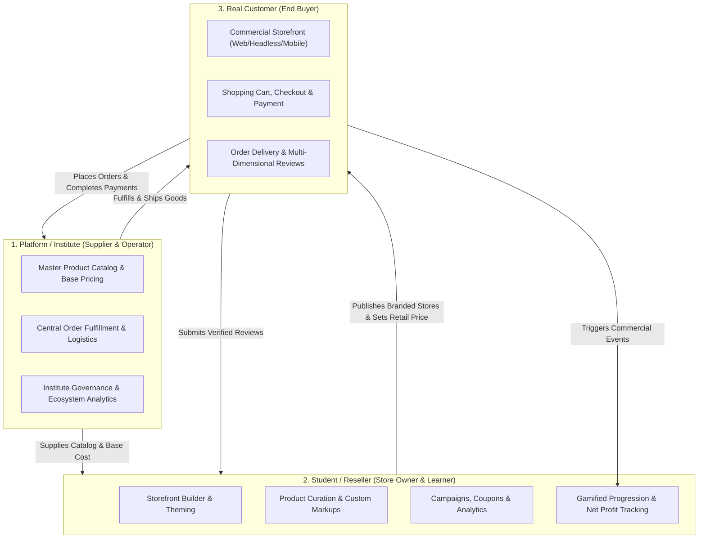
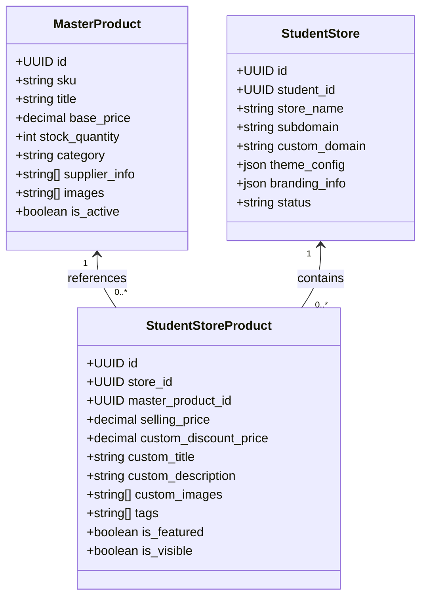
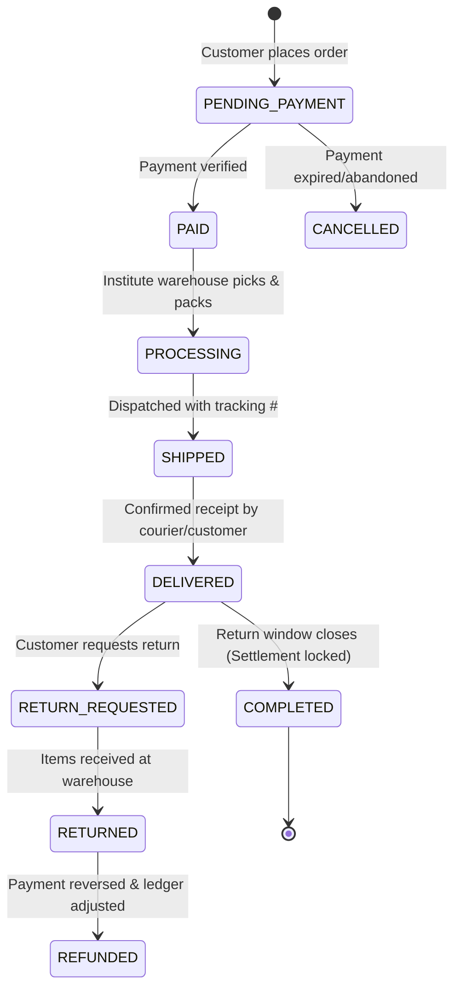
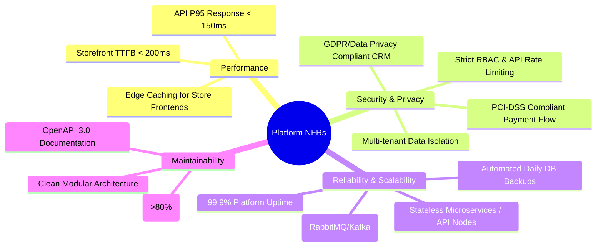
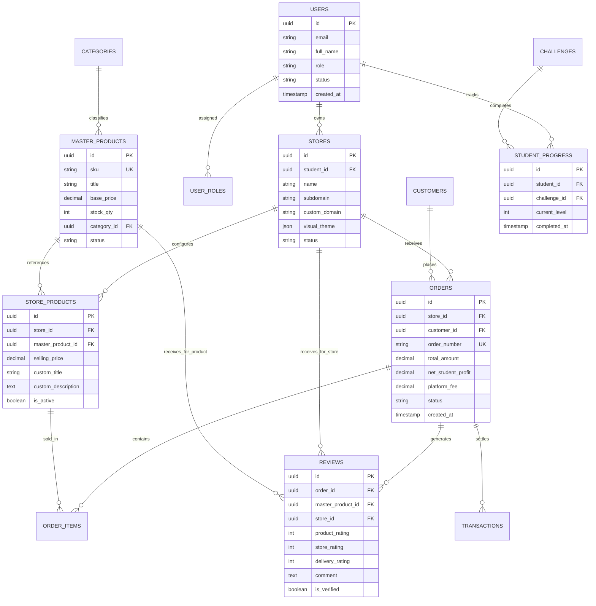
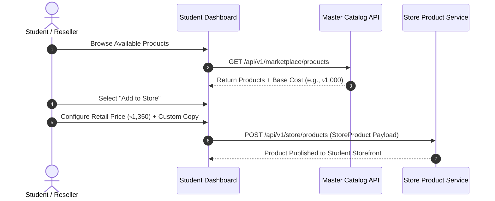
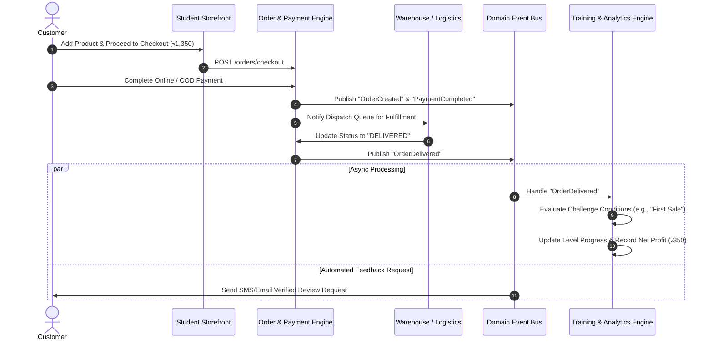
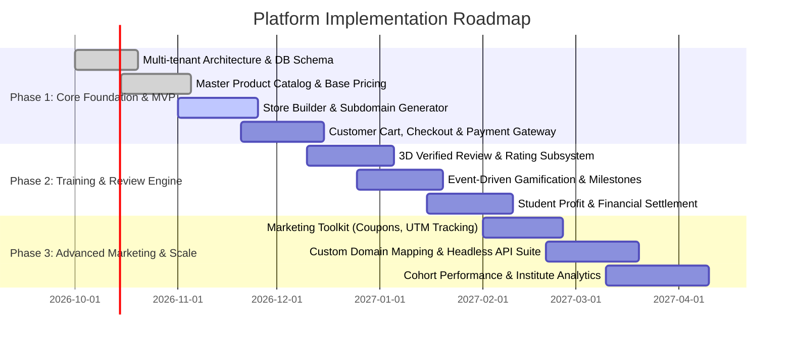

# Software Requirements Specification & Requirement Analysis
**Project:** Commercial E-Commerce Reseller & Training Platform  
**Version:** 1.0.0  
**Source Document:** [`docs/business_logic.md`](file:///media/shadhin/secandary/code/Are%20You%20read%20to%20sales/docs/business_logic.md)  
**Status:** Approved / Draft for Architectural Design & Implementation  

---

## 1. Executive Summary & Platform Vision

### 1.1 Vision & Mission
The Commercial E-Commerce Reseller & Training Platform is a hybrid ecosystem designed to bridge theoretical entrepreneurship training with real-world commercial commerce operations under the core principle: **"Learn by running a real business."**

Rather than simulating transactions in sandbox environments, students operate real multi-tenant e-commerce storefronts backed by central institute inventory, receive real orders, collect payments, build store reputations through verified customer reviews, and earn real net profits. A built-in event-driven gamification and training layer tracks every commercial event (store publishing, sales, fulfillment, customer feedback) and converts operational milestones into structured educational achievements.



### 1.2 Core Business Value Propositions
1. **For the Institute / Platform Operator:**
   - Monetize inventory and central supply chain at scale.
   - Aggregate sales across hundreds/thousands of student storefronts.
   - Generate multi-stream revenues (product margins, platform commissions, software subscriptions, and educational course fees).
   - Automatically track student performance and training efficacy using objective commercial metrics.

2. **For the Student / Reseller:**
   - Zero-inventory-risk e-commerce launchpad.
   - Real-time learning through active digital marketing, storefront branding, pricing strategy, customer service, and conversion optimization.
   - Direct net earnings generated from customer markups.
   - Clear gamified career progression from "Store Starter" to "Top Performer".

3. **For the Real Customer:**
   - Seamless, modern, high-trust consumer e-commerce experience.
   - Reliable product quality backed by institute supply and verified multi-dimensional ratings.

---

## 2. Main Actors & User Roles

### 2.1 Actor Taxonomy & Permissions Matrix

| Actor / Role | Description | Primary Responsibilities | Scope & Data Access |
| :--- | :--- | :--- | :--- |
| **Super Admin** | System owner / Infrastructure operator | Platform configuration, payment gateway setup, global audit logs, institute-level settings | Global System |
| **Institute Admin** | Institute leadership / Operations head | Student admissions, central inventory oversight, overall financial settlement, dispute arbitration | Organization-wide |
| **Product Manager** | Catalog & inventory specialist | Master catalog management, SKU creation, supplier relations, central stock allocation, base pricing | Global Catalog |
| **Order Manager** | Warehouse & logistics operator | Order processing, warehouse dispatch, shipment tracking updates, returns & refunds handling | Global Order Fulfillment |
| **Training Manager** | Instructor / Academic evaluator | Challenge creation, milestone configuration, student cohort progress tracking, feedback & coaching | Educational & Cohort Data |
| **Support Agent** | Customer & student support | Resolving platform inquiries, handling escalations, mediating store disputes | Ticketing & Resolution |
| **Student / Reseller** | Store owner & entrepreneur learner | Storefront design, product markup configuration, marketing campaigns, customer CRM, tracking net profit & training progress | Tenant/Store Isolated |
| **Customer** | End-consumer / Product purchaser | Browsing student stores, purchasing items, tracking order deliveries, submitting verified product/store reviews | Order/Session Isolated |

---

## 3. Functional Requirements (FR)

### Module 1: Multi-Tenant Architecture & Store Management (FR-01)
* **FR-01.1 Subdomain & Custom Domain Routing:**
  - The system must provide instant wildcard subdomain generation (e.g., `store-name.platform.com`).
  - The platform must support custom domain mapping (e.g., `store-name.com`) with automated SSL provisioning for paid/pro tiers.
* **FR-01.2 Store Branding Customization:**
  - Store owners must be able to configure: Store Name, Tagline, Logo, Favicon, Social Links, Business Contact details, and SEO metadata.
* **FR-01.3 Theme Engine & Visual Layout:**
  - Resellers must be able to customize visual design: Color palette (Primary, Secondary, Accent, Background), Typography, Button Corner Radius, Product Card Styles, Header Navigation, and Footer Content.
  - The system must support configurable homepage sections (Hero banners, promotional grids, featured collections, FAQ, policy pages).
* **FR-01.4 Tenant Isolation:**
  - Each student store must function as an independent tenant. Orders, customers, store-specific settings, and analytics must be strictly partitioned by `store_id`.



---

### Module 2: Master Product Catalog & Reseller Pricing (FR-02)
* **FR-02.1 Central Product Catalog:**
  - The platform must maintain a centralized master catalog with: SKU, Master Title, Supplier Costs, Base Price, Master Images, Specifications, Category Hierarchy, and Central Inventory Counts.
* **FR-02.2 Product Discovery Marketplace for Students:**
  - Students must have access to an internal discovery catalog to filter, view base prices, calculate projected margins, and import products into their individual stores with a single click.
* **FR-02.3 Domain Entity Decoupling (`MasterProduct` vs. `StudentStoreProduct`):**
  - The platform must strictly decouple institute master data from student storefront representations.
  - **Institute-Controlled Attributes:** SKU, Base Price (Cost), Stock Availability, Supplier Details, Core Category.
  - **Student-Controlled Attributes:** Retail Selling Price, Promotional/Discount Price, Custom Marketing Title, Custom Copywriting, Curated Gallery, and Tags.
* **FR-02.4 Pricing & Profit Calculation Logic:**
  - The system must enforce: $\text{Customer Selling Price} \ge \text{Institute Base Price}$.
  - The system must automatically calculate Gross Margin:
    $$\text{Gross Margin} = \text{Selling Price} - \text{Base Price}$$
  - The financial engine must compute Real Net Profit on completed orders:
    $$\text{Net Profit} = \text{Selling Price} - \text{Base Cost} - \text{Platform Commission} - \text{Payment Gateway Fee} - \text{Shipping Cost} - \text{Discounts}$$

---

### Module 3: Customer Experience, Cart & Order Lifecycle (FR-03)
* **FR-03.1 Customer Storefront & Catalog Browsing:**
  - Responsive, mobile-first consumer storefronts rendering student-customized themes, pricing, and content.
  - Category navigation, search, filtering, and rich product detail pages.
* **FR-03.2 Shopping Cart & Checkout:**
  - Session-based and user-authenticated shopping cart management.
  - Dynamic checkout supporting customer delivery address capture, shipping fee calculation, and coupon application.
* **FR-03.3 Payment Gateway Processing:**
  - Multi-gateway integration (Credit/Debit Cards, Mobile Financial Services [bKash/Nagad/Rocket], Cash on Delivery [COD]).
  - Automated payment verification, webhook handling, and split-ledger recording.
* **FR-03.4 End-to-End Order State Machine:**
  - The platform must transition orders through clear, auditable states:



---

### Module 4: Multi-Dimensional & Verified Customer Reviews (FR-04)
* **FR-04.1 Tri-Dimensional Feedback Separation:**
  To guarantee ratings integrity and protect product quality metrics from logistics anomalies, reviews must be recorded across three independent vectors:
  1. **Product Review:** Product Quality, Material/Accuracy, Value for Money ($1-5\bigstar$).
  2. **Store / Seller Review:** Seller Communication, Store Presentation, Support Quality ($1-5\bigstar$).
  3. **Delivery Review:** Delivery Speed, Packaging Condition, Courier Professionalism ($1-5\bigstar$).
* **FR-04.2 Verified Purchase Gating:**
  - Only customers with an order in `DELIVERED` or `COMPLETED` state can submit reviews.
  - Automatically append a `✓ Verified Purchase` badge to validated reviews.
* **FR-04.3 Aggregated Store & Product Reputation:**
  - Compute rolling weighted ratings:
    - Master Product Reputation (aggregated globally across all student storefront sales).
    - Student Store Reputation (store rating, response rate, order completion rate, repeat customer percentage).

---

### Module 5: Event-Driven Gamified Training Engine (FR-05)
* **FR-05.1 Domain Event Orchestration:**
  - The system must capture all key business actions as asynchronous domain events:
    `StoreCreated`, `ProductAddedToStore`, `StoreThemeCustomized`, `StorePublished`, `FirstVisitorRecorded`, `OrderCreated`, `PaymentCompleted`, `OrderDelivered`, `ReviewReceived`, `RevenueMilestoneReached`.
* **FR-05.2 Structured Challenges & Guided Quests:**
  - Real-time progression based on live operational accomplishments:

```mermaid
flowchart LR
    C1["Challenge 1: Create Store"] --> C2["Challenge 2: Add 5 Products"]
    C2 --> C3["Challenge 3: Launch Promo Campaign"]
    C3 --> C4["Challenge 4: Receive 1st Order"]
    C4 --> C5["Challenge 5: Fulfill 1st Sale"]
    C5 --> C6["Challenge 6: Collect 1st Verified Review"]
    C6 --> C7["Challenge 7: Reach 10 Orders"]
    C7 --> C8["Challenge 8: Hit ৳10,000 Revenue"]
```



* **FR-05.3 Reseller Career Levels:**
  - Tier progression based on composite commercial criteria:
    - **Level 1 — Store Starter:** Store configured, $\ge 1$ product published.
    - **Level 2 — Product Seller:** First commercial order completed.
    - **Level 3 — Active Reseller:** 10+ completed orders, $\ge 4.0\bigstar$ rating.
    - **Level 4 — Growth Seller:** 50+ completed orders, $\ge ৳50,000$ gross revenue.
    - **Level 5 — Pro Seller:** 150+ completed orders, $\ge 4.5\bigstar$ rating, repeat customer rate $\ge 15\%$.
    - **Level 6 — Top Performer:** 500+ completed orders, sustained commercial profitability.
* **FR-05.4 Intelligent Operational Recommendations:**
  - Training engine analyzes conversion funnels and provides contextual guidance (e.g., *"High product views but low checkout conversion detected $\rightarrow$ recommendation: adjust retail pricing, refine product descriptions, or add customer proof badges"*).

---

### Module 6: Student Workspace, CRM & Marketing Suite (FR-06)
* **FR-06.1 Business & Learning Dashboard:**
  - Real-time display of: Gross Revenue, Net Profit, Order Count, Unique Customers, Average Rating, Conversion Funnel (Views $\rightarrow$ Carts $\rightarrow$ Checkouts $\rightarrow$ Sales), and Training Milestone checklist.
* **FR-06.2 Tenant Customer Management (CRM):**
  - Isolated customer directory per student store: Customer Name, Phone, Email, Delivery Addresses, Order History, Total Spend, and Review History.
* **FR-06.3 Reseller Marketing Toolkit:**
  - Coupon & discount code engine (percentage, fixed amount, minimum purchase rules).
  - Campaign tracking (UTM parameters, referral links, traffic source analytics).
  - Social share kit (instant product card generators for Instagram, Facebook, WhatsApp).

---

### Module 7: Headless & Dedicated E-Commerce APIs (FR-07)
* **FR-07.1 Headless Storefront API Support:**
  - Expose clean REST/GraphQL APIs enabling custom frontends (Next.js, Remix, React Native, Mobile Apps) to interface with the core platform.
* **FR-07.2 Core API Endpoints:**
  ```text
  GET    /api/v1/stores/{store_slug}/meta
  GET    /api/v1/stores/{store_slug}/theme
  GET    /api/v1/stores/{store_slug}/products
  GET    /api/v1/stores/{store_slug}/products/{product_id}
  POST   /api/v1/stores/{store_slug}/cart
  POST   /api/v1/stores/{store_slug}/checkout
  POST   /api/v1/stores/{store_slug}/orders
  GET    /api/v1/stores/{store_slug}/orders/{order_id}/track
  POST   /api/v1/stores/{store_slug}/reviews
  ```

---

### Module 8: Institute Oversight & Global Operations (FR-08)
* **FR-08.1 Student & Store Moderation:**
  - Account approvals, store status toggling (Active, Under Review, Suspended), compliance monitoring against misleading claims.
* **FR-08.2 Master Fulfillment Center:**
  - Consolidated order queue with batch packing slips, courier dispatch manifest generation, and stock decrement triggers.
* **FR-08.3 Global Financial & Commission Settlement:**
  - Automated ledger tracking institute revenues, student payout liabilities, payment gateway charges, and tax withholdings.
  - Student withdrawal/payout management system with bank/MFS transfer processing.

---

## 4. Non-Functional Requirements (NFR)



### 4.1 Performance & Latency
- **NFR-01.1:** Public storefront pages must achieve a Time-to-First-Byte (TTFB) $< 200\text{ ms}$ via edge CDN caching.
- **NFR-01.2:** Storefront APIs must maintain a P95 latency $< 150\text{ ms}$ under nominal load.
- **NFR-01.3:** The checkout pipeline must handle concurrent surges of $\ge 500\text{ requests/sec}$ without double-allocation of master inventory.

### 4.2 Security, Multi-Tenancy & Data Protection
- **NFR-02.1:** Strict Tenant Boundary Enforcement: Database queries on store-scoped resources must always filter by verified `tenant_id` / `store_id`.
- **NFR-02.2:** Customer PII (Personally Identifiable Information) must be encrypted at rest (AES-256) and in transit (TLS 1.3).
- **NFR-02.3:** Role-Based Access Control (RBAC) enforced via JWT tokens and fine-grained middleware policy guards.

### 4.3 Scalability & Availability
- **NFR-03.1:** High Availability: 99.9% uptime target with zero-downtime rolling deployments.
- **NFR-03.2:** Event-driven architecture utilizing distributed message queues (e.g., Redis Streams / RabbitMQ / Kafka) to prevent synchronous coupling between order checkout and analytics/gamification computations.

---

## 5. Domain Data Model & Entity Relationship



---

## 6. End-to-End System Workflows

### 6.1 Product Discovery to Store Listing


### 6.2 Customer Checkout to Event-Driven Learning Settlement


---

## 7. Monetization & Subscription Matrix

| Revenue Stream | Payer | Mechanism | Description |
| :--- | :--- | :--- | :--- |
| **Inventory Base Margin** | Student / Customer | Difference between Wholesale Cost & Institute Base Price | Institute earns on every physical unit dispatched from warehouse. |
| **Platform Commission** | Reseller (per order) | Fixed percentage (e.g., 2-5%) or flat fee per transaction | Charged for commerce infrastructure and payment handling. |
| **Store SaaS Subscription** | Student | Tiered recurring fee (Free, Starter, Pro, Business) | Unlocks custom domains, advanced analytics, zero commission rates, and premium themes. |
| **Training & Certification Fees**| Student | Course tuition / Cohort entry fee | Enrollment in guided training programs and certified entrepreneur tracks. |

---

## 8. Implementation Roadmap & Phase-Wise Delivery



---

## 9. Traceability & Verification Matrix

| Business Logic Section | Requirement ID | Test / Verification Method | Acceptance Criteria |
| :--- | :--- | :--- | :--- |
| **§5, §17: Product Model** | FR-02.1, FR-02.3 | Integration Test | Modifying master product base price does not overwrite student-customized retail markup descriptions; stock updates sync automatically. |
| **§6, §7: Store Builder & APIs** | FR-01.1, FR-07.2 | Automated End-to-End Test | Custom subdomains resolve correct tenant theme, product listings, and cart within $<200\text{ ms}$. |
| **§9, §10: 3D Reviews** | FR-04.1, FR-04.2 | API Contract & Security Test | Non-buyers cannot post reviews; verified buyers can review Product, Store, and Delivery separately with `✓ Verified Purchase` badge. |
| **§18: Pricing & Net Profit** | FR-02.4, FR-08.3 | Financial Audit Unit Tests | Net profit displayed to student strictly reflects $\text{Customer Price} - (\text{Base} + \text{Fees} + \text{Shipping} + \text{Discounts})$. |
| **§19, §20: Event Gamification** | FR-05.1, FR-05.2 | Asynchronous Event Test | Emitting `OrderDelivered` automatically increments student order count, unlocks corresponding challenge, and recalculates level. |

---
*Document maintained by Engineering & Product Team. Reference original architecture at [`docs/business_logic.md`](file:///media/shadhin/secandary/code/Are%20You%20read%20to%20sales/docs/business_logic.md).*
