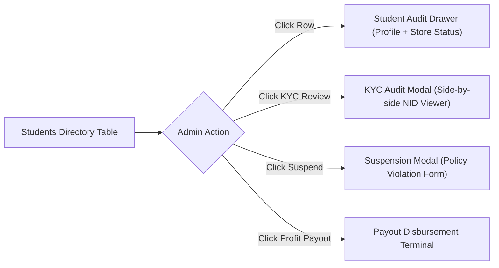
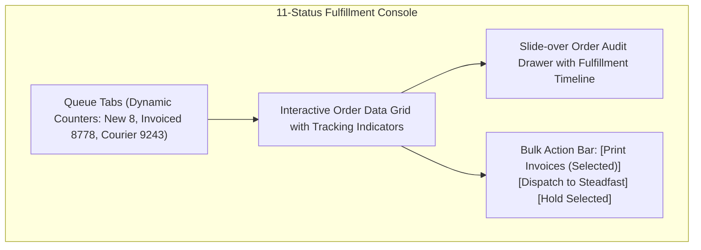
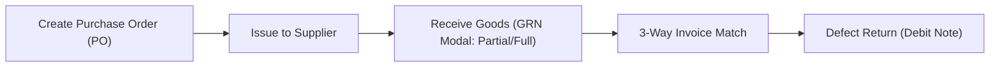
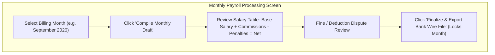

# Enterprise UI Architecture & Integration Plan (TDD Blueprint)

**Document ID:** UI-INT-TDD-2026-V1  
**Target:** Institute Administration Portal Frontend Application (`apps/admin-dashboard`)  
**Framework:** React 18, Vite, TypeScript, Tailwind CSS, `@repo/ui`, Vitest, React Testing Library, Playwright  
**Methodology:** Strict Frontend Test-Driven Development (🔴 RED -> 🟢 GREEN -> 🔵 REFACTOR)  
**Related Documents:**
- [`docs/api_implementation_plan_tdd.md`](./api_implementation_plan_tdd.md)
- [`docs/admin_portal_task_plan.md`](./admin_portal_task_plan.md)
- [`apps/admin-dashboard/src/components/AdminLayout.tsx`](../apps/admin-dashboard/src/components/AdminLayout.tsx)
- [`packages/api-client/src/index.ts`](../packages/api-client/src/index.ts)

---

## 1. Frontend Architecture & TDD Lifecycle

This blueprint establishes the client-side architecture for the Institute Administration Portal. It specifies how UI forms, data tables, multi-step wizards, state management, and API integrations are engineered under strict Test-Driven Development.

```mermaid
flowchart TD
    subgraph UI_TDD ["Frontend Test-Driven Development Lifecycle"]
        R1["🔴 RED: Write Vitest + RTL Component Spec"]
        R2["Mock Network API via MSW (Mock Service Worker)"]
        R3["Assert Form Validations, Loading States & Dom Selectors"]
        R4["Run Test -> Confirm Spec Fails on Missing Component"]
        
        G1["🟢 GREEN: Implement Component & Hook Logic"]
        G2["Wire React Hook Form + Zod Schema Validation"]
        G3["Bind TanStack Query / apiClient Fetchers"]
        G4["Run Test -> Component Renders & All Tests Pass"]
        
        B1["🔵 REFACTOR: Optimize Re-renders (memo/callbacks)"]
        B2["Ensure A11y (ARIA labels, keyboard navigation)"]
        B3["Add Playwright E2E Multi-Step User Flow"]
    end

    R1 --> R2 --> R3 --> R4 --> G1 --> G2 --> G3 --> G4 --> B1 --> B2 --> B3
```



### 1.1 The UI RED-GREEN-REFACTOR Protocol
1. **🔴 RED Phase:**
   - Define component props, form schemas, and user interaction contracts.
   - Write unit/integration tests with `@testing-library/react` and Vitest:
     - Verify form validation error messages display when invalid data is submitted.
     - Verify loading skeletons render while API requests are pending.
     - Verify error alerts appear on 4xx/5xx HTTP responses.
     - Verify table pagination, sort toggles, and search inputs emit expected queries.
   - Run tests and confirm failure (`FAIL: Cannot find element by text / role`).
2. **🟢 GREEN Phase:**
   - Implement the minimal React component using `@repo/ui` primitives (Dialog, Table, Input, Badge, Button).
   - Wire form handling using `react-hook-form` and `@hookform/resolvers/zod`.
   - Wire asynchronous data fetching and cache invalidation via TanStack Query and `apiClient`.
   - Run tests and verify 100% pass rate.
3. **🔵 REFACTOR Phase:**
   - Extract repeatable sub-components (StatusBadges, ActionDrawers, MetricCards).
   - Optimize heavy table rendering with virtualized rows if dataset exceeds 100 items.
   - Run automated axe-core accessibility checks (`expect(await axe(container)).toHaveNoViolations()`).

---

## 2. Shared Data Table & Form Engine Architecture

### 2.1 Standardized Data Table Engine (`DataTable.tsx`)
All administrative list views utilize a unified, feature-rich data grid engine supporting:
- **URL Query Synchronization:** Filters, search keywords, page index, and sort directions persist in URL search parameters (`?page=2&status=HOLD&search=Chittagong`), enabling instant bookmarking and browser back/forward navigation.
- **Multi-Select & Bulk Actions Bar:** Sticky floating bottom toolbar that activates when $\ge 1$ row is selected (supporting actions like *Bulk Invoicing*, *Courier Reassignment*, *Export to CSV*).
- **Responsive Drawer View:** Clicking any row opens a slide-over `Sheet` drawer with tabbed detail audits, eliminating disruptive page reloads.
- **Configurable Column Visibility:** User can toggle column display preferences, cached in browser `localStorage`.

### 2.2 Standardized Form Engine (`FormDialog.tsx` & `FormWizard.tsx`)
- **Strict Zod Type Invariants:** Every form input is strictly validated with client-side Zod schemas matching backend DTO definitions.
- **Unsaved Changes Guard:** Warns users if they attempt to close a modal or navigate away with modified, unsubmitted form fields.
- **Asynchronous Uniqueness Checks:** Input fields (e.g. SKU, Branch Code, Phone, Trade License) execute debounced (300ms) validation against backend check endpoints before enabling the submission button.

---

## 3. Module-by-Module UI Workflows, Forms, Tables & TDD Specs

---

### Module 1: Students & Student Governance
**Navigation Targets:** `Pending Students`, `Registered Students`, `Cancel Students`, `Students Profit Payment`



#### Form Specifications
1. **KYC Audit & Verification Modal:**
   - **Fields:**
     - Student Full Name, Phone, Registered Email (Read-only).
     - National ID / Passport Number (Editable with change reason).
     - Side-by-Side Document Viewer: High-res NID Front, NID Back, and Live Photo with zoom controls.
     - Decision: `APPROVE` vs `REJECT` toggle.
     - Rejection Reason Dropdown: *Blurry Document*, *Name Mismatch*, *Expired ID*, *Suspicious Alteration*.
     - Auditor Notes textarea.
   - **Zod Schema:**
     ```typescript
     export const KycVerificationSchema = z.object({
       decision: z.enum(["APPROVE", "REJECT"]),
       rejectionReason: z.string().optional(),
       auditorNotes: z.string().min(5, "Auditor notes must be at least 5 characters"),
     }).refine((data) => data.decision !== "REJECT" || !!data.rejectionReason, {
       message: "Rejection reason is required when rejecting KYC",
       path: ["rejectionReason"],
     });
     ```
2. **Student Store Suspension Modal:**
   - **Fields:** Mandatory Violation Type (*Counterfeit Goods*, *Non-fulfillment*, *Spam Marketing*), Immediate Store Hide checkbox, Suspension Length (*24 Hours*, *7 Days*, *Permanent*), Documented Admin Notes.

#### Data Table Specifications
- **Columns:** Student Avatar/Name, Email/Phone, Campus Branch, Enrolled Batches, Store Status (`ACTIVE`, `SUSPENDED`, `DRAFT`), KYC Badge (`VERIFIED`, `PENDING`), Completed Orders, Net Profit Earned, Actions.
- **Filters:** Branch dropdown, KYC status toggle, Store Status multiselect, Search input.

#### TDD Suite Specification
- 🔴 **Vitest Spec (`KycAuditModal.spec.tsx`):**
  - Renders document preview thumbnails with zoom controls.
  - Selecting `REJECT` without selecting a reason displays validation error: `"Rejection reason is required"`.
  - Submitting `APPROVE` triggers `apiClient.adminDashboard.verifyKyc`, displays success toast, and closes modal.

---

### Module 2 & 3: Campus Branches & Student Batches
**Navigation Targets:** `Branches`, `Student Batches`

#### Form Specifications
1. **Create / Edit Campus Branch Modal:**
   - **Fields:** Branch Name, Unique Branch Code (`DHK-01`), Branch Type (`PHYSICAL` / `DIGITAL`), Physical Address, City, Contact Phone, Manager Selector (auto-complete search among users with `BRANCH_MANAGER` role).
2. **Create Student Batch Modal:**
   - **Fields:** Batch Name, Batch Code (`BATCH-2026-A`), Branch Selector, Instructor Selector, Start Date, End Date, Max Capacity (integer, min: 5, max: 200).

#### Data Table Specifications
- **Branch Grid:** Branch Card view showing Active Batches count, Total Students, Revenue Generated, and Manager Contact.
- **Batch Table:** Code, Branch, Instructor, Capacity Progress Bar (`34 / 50 Students`), Status (`UPCOMING`, `ACTIVE`, `COMPLETED`), Actions (*Manage Enrollments*, *Graduation Audit*).

#### TDD Suite Specification
- 🔴 **Vitest Spec (`BatchCreateDialog.spec.tsx`):**
  - Rejects End Date earlier than Start Date with inline date validation error.
  - Submitting valid form dispatches POST request and invalidates `branches-batches` query cache.

---

### Module 4 & 5: Orders, Fulfillment & Courier Tracking
**Navigation Targets:** `Order Overview`, `All Orders`, `New Orders`, `Complete Orders`, `Partial Delivered`, `Unmatch Orders`, `Invoiced Orders`, `Hold Orders`, `Cancelled Orders`, `In Courier`



#### Form & Action Modal Specifications
1. **Courier Handover & Consignment Dispatch Modal:**
   - **Fields:** 3PL Logistics Provider (Steadfast, Pathao, RedX), Service Type (*Standard Next Day*, *Express Same Day*), Pickup Hub location, Weight Override (kg), Fragile / Liquid package flag.
2. **Barcode Discrepancy Quarantine Modal (`UNMATCH` Queue):**
   - **Fields:** Scanned Barcode input, Expected Invoice manifest list, Discrepancy Reason (*Wrong SKU packed*, *Missing item*, *Unreadable barcode*), Override Supervisor PIN.

#### Data Table Specifications
- **Columns:** Checkbox, Order Number, Store / Student Name, Customer Name & District, Total Amount (BDT), Payment Method (`COD`, `BKASH`), Courier & Tracking Code, Fulfillment Status Badge, Order Age Timer (e.g., `4 hrs ago`, highlighted red if $> 24\text{h}$ in `NEW`), Actions.
- **Bulk Operations:**
  - *Bulk Invoicing:* Transitions selected `NEW` orders to `INVOICED` and opens printable PDF waybill batch window.
  - *Bulk Courier Dispatch:* Generates tracking numbers via courier API in a single click.

#### TDD Suite Specification
- 🔴 **Vitest Spec (`FulfillmentPage.spec.tsx`):**
  - Clicking on `New Orders (8)` tab filters data grid to `status=NEW` and updates URL parameter.
  - Selecting 3 orders displays the floating Bulk Actions bar with counter `3 Orders Selected`.
  - Dispatching consignment with missing shipping address displays error banner.

---

### Module 6: Exchange Orders Suite
**Navigation Targets:** `Exchange Overview`, `All Exchange Orders`, `New Exchange Orders`, `Complete Exchange Orders`, `Invoiced Exchange Orders`, `Hold Exchange Orders`, `Cancelled Exchange Orders`, `Exchange In Courier`

#### Form Specifications
1. **Multi-Step Create Exchange Order Wizard:**
   ```mermaid
   graph LR
       S1["Step 1: Original Order Lookup"] --> S2["Step 2: Return Items & Defect Reason"]
       S2 --> S3["Step 3: Replacement SKU Selection"]
       S3 --> S4["Step 4: Price Delta & Waybill Preview"]
   ```
   - **Step 1:** Search original Order Number (`#ORD-94812`). Validates delivery date within 7-day exchange window.
   - **Step 2:** Checklist of original items. Select quantity to return. Attach photo proof (drag-and-drop file uploader). Select defect reason (*Size too small*, *Defective stitching*, *Color mismatch*).
   - **Step 3:** Master catalog SKU selector for replacement items. Real-time stock availability check.
   - **Step 4:** Automatic Price Calculator:
     $$\text{Customer Pays / Receives} = (\text{Replacement Price} - \text{Returned Price}) + \text{Exchange Delivery Fee (BDT 120)}$$
     Generates dual waybill: Reverse Pickup for old item + Forward Dispatch for new item.

#### Data Table Specifications
- **Columns:** Exchange ID (`#EX-2026-104`), Original Order Number, Customer Name & City, Returned Item, Replacement Item, Price Adjustment ($+ \text{BDT } 250$), Pickup Status (`PENDING`, `IN_TRANSIT`, `RECEIVED`), Delivery Status, Overall Workflow State.

#### TDD Suite Specification
- 🔴 **Vitest Spec (`CreateExchangeWizard.spec.tsx`):**
  - Wizard prevents proceeding from Step 2 if no proof photos are uploaded for "Defective" reason.
  - Step 4 correctly calculates differential: Replacement (BDT 1,200) - Original (BDT 1,000) + Fee (BDT 120) = BDT 320.

---

### Module 7: External Seller Panel
**Navigation Targets:** `Overview`, `Seller List`, `Seller Adjustment`, `Support Tickets`, `Active Seller`

#### Form Specifications
1. **Onboard / Edit Seller Modal:**
   - **Fields:** Company Name, Contact Person Name, Email, Phone, Seller Type (`MERCHANT`, `INSTRUCTOR`, `SUPPLIER`), Trade License Number, TIN/BIN Number, Commission Rate (% slider from 0% to 30%), Settlement Bank Account Details.
2. **Manual Seller Adjustment Form:**
   - **Fields:** Seller selector, Adjustment Type (`CREDIT` incentive vs `DEBIT` chargeback/penalty), Amount (BDT), Reference Order / Ticket ID, Mandatory Supporting Documentation attachment, Detailed reason explanation.

#### Data Table Specifications
- **Seller Directory:** Company, Type, Trade License, Commission Rate, Active Listed Products, Completed Orders, Compliance Score (visual color badge: $>90$ Green, $75-89$ Amber, $<75$ Red), Status (`PENDING`, `APPROVED`, `SUSPENDED`).

#### TDD Suite Specification
- 🔴 **Vitest Spec (`SellerAdjustmentDialog.spec.tsx`):**
  - Submitting negative adjustment without selecting a violation reason code throws validation error.
  - Adjustments $> \text{BDT } 10,000$ render a banner: `"Requires Dual-Admin Authorization"`.

---

### Module 8: Payments & Financial Settlements
**Navigation Targets:** `Payment Requests`, `Payment Paid`, `Payment Methods`

#### Form Specifications
1. **Payout Approval & Disbursement Terminal:**
   - Displays student/seller historical earnings summary, current available wallet balance, and requested withdrawal amount.
   - Channel Selection: `BKASH_DISBURSEMENT_API`, `NAGAD_DIRECT`, or `BEFTN_BANK_TRANSFER`.
   - Transaction Reference input (pre-populated by API or manually entered for bank wire).
   - "Verify & Disburse Funds" high-priority button requiring confirmation dialog.
2. **Configure Payment Gateway Modal:**
   - **Fields:** Gateway Selector (`bKash`, `Nagad`, `SSLCommerz`), Mode (`Sandbox` vs `Production`), Merchant App Key, Secret Key (masked password field), Callback Webhook URL, Gateway Fee Surcharge (%).

#### Data Table Specifications
- **Pending Payouts Table:** Request ID, Recipient Name & Role, Requested Amount, Account Details (MFS Number / Bank Account & Routing), Date Requested, Processing SLA Status, Action buttons (*Approve & Disburse*, *Reject with Reason*).

#### TDD Suite Specification
- 🔴 **Vitest Spec (`PayoutApprovalModal.spec.tsx`):**
  - Clicking "Approve & Disburse" opens security modal requiring admin password / 2FA code.
  - Disabling gateway configuration toggles live status indicator on storefront.

---

### Module 9: Purchases & Procurement
**Navigation Targets:** `Add Purchase`, `Manage Purchase`, `Add Purchase Order`, `Manage Purchase Order`, `Purchase Return List`, `Purchase Return Type`



#### Form Specifications
1. **Dynamic Purchase Invoice Entry Form:**
   - **Header:** Supplier Dropdown, Purchase Date, Supplier Invoice Number, Warehouse Hub Selector.
   - **Line Items Repeater:**
     - Dynamic row addition: SKU autocomplete search, Item Title, Purchase Quantity, Unit Cost, Landed Freight Allocation, Tax %, Total Row Cost.
     - Real-time grand total, tax summary, and paid amount vs balance due calculation.
2. **Goods Received Note (GRN) Inspector:**
   - Displays issued PO items. Allows warehouse clerk to input `Received Qty` and `Rejected/Damaged Qty` with immediate barcode generation for accepted items.

#### Data Table Specifications
- **PO Management Table:** PO Number, Supplier, Expected Delivery Date, Total Value, Delivery Progress Bar, Payment Status (`UNPAID`, `PARTIAL`, `PAID`), Actions (*Receive Goods*, *Print PO PDF*).

#### TDD Suite Specification
- 🔴 **Vitest Spec (`AddPurchaseForm.spec.tsx`):**
  - Adding multiple SKUs automatically aggregates subtotal, freight, and tax.
  - Rejects purchase entry with empty line items table.

---

### Module 10: Products & Master Catalog Configuration
**Navigation Targets:** `Product`, `Categories`, `Subcategories`, `Sizes`, `Colors`, `Brands`

#### Form Specifications
1. **Master Product Catalog Editor:**
   - Multi-tab form:
     - *General Info:* Title, Category & Subcategory cascade, Brand selector, Master Description (Rich text editor).
     - *Pricing & Base Cost:* Base Cost (BDT), Suggested Retail Price, Minimum Selling Price.
     - *Media Gallery:* Drag-and-drop multi-image uploader with primary thumbnail selector and image cropping.
     - *Variant Generator:* Size checklist (S, M, L, XL) and Color palette picker. Generates variant SKU matrix with individual barcode inputs.
2. **Category Hierarchy Manager:**
   - Parent Category selector (allows null for root categories), Category Name, URL Slug, Banner Image uploader, Display Priority sort order.

#### Data Table Specifications
- **Catalog Grid:** Thumbnail, SKU, Product Title, Category, Base Price, Live Inventory Stock, Visibility Switch (`Active` on student marketplace vs `Draft`), Action menu.

#### TDD Suite Specification
- 🔴 **Vitest Spec (`MasterProductEditor.spec.tsx`):**
  - Selecting 2 sizes and 3 colors generates exactly 6 rows in the variant matrix table.
  - Base price higher than Suggested Retail Price displays warning notice.

---

### Module 11: Physical Inventory & Stock Ledger
**Navigation Targets:** `Stock`, `Ledger`, `Adjustments`

#### Form Specifications
1. **Manual Stock Adjustment Modal:**
   - **Fields:** Product SKU search, Warehouse Hub, System Count (Read-only, e.g. 45), Actual Physical Count (Input, e.g. 42), Calculated Discrepancy ($-3$), Adjustment Reason (`DAMAGED_IN_WAREHOUSE`, `THEFT_SHRINKAGE`, `AUDIT_COUNT_CORRECTION`), Supervisor Signature Notes.

#### Data Table Specifications
- **Stock Matrix:** SKU, Title, Category, On-Hand Qty, Reserved Qty, Available Qty, Reorder Level, Days of Stock Remaining (progress indicator: Red if $<7$ days, Green if $>30$ days).
- **Audit Ledger:** Timestamp, SKU, Movement Type (`PURCHASE_IN`, `FULFILLMENT_OUT`, `EXCHANGE_HOLD`), Qty Delta ($+50$ or $-2$), Running Balance After, Reference PO/Order link.

#### TDD Suite Specification
- 🔴 **Vitest Spec (`StockAdjustmentModal.spec.tsx`):**
  - Entering physical count lower than system count requires selecting a shrinkage reason code.
  - Submitting adjustment updates local table state optimistically.

---

### Module 12: Operational Reports & Analytics
**Navigation Targets:** `Product Courier Status`, `Supplier Product Report`, `Supplier Profit Lifecycle`

#### UI Specifications & Visualizations
1. **Courier Performance Dashboard:**
   - Date range selector, Courier comparison cards (Delivery Success Rate %, Average Transit Days, RTO Rate %).
   - Multi-series delivery timeline chart (Recharts) and district failure heatmap.
2. **Supplier Profit Lifecycle:**
   - Tabular report showing Gross Purchases, Total Units Sold, Defect Return %, Landed Gross Margin %, and Supplier Quality Scorecard. Exportable to CSV / Excel.

---

### Module 13: Wholesale B2B Operations
**Navigation Targets:** `Create Wholesale`, `Manage Wholesale`, `Product Wise Report`

#### Form Specifications
1. **Create Wholesale Order:**
   - Buyer Business Entity selector, Commercial BIN/TIN validation, Tiered Pricing discount selector, Bulk Delivery Scheduling, Payment Terms (50% Advance, 50% on Delivery).

---

### Module 14: Suppliers Directory
**Navigation Target:** `Suppliers`

#### Form Specifications
1. **Supplier Registration:**
   - Supplier Company Name, Primary Contact Person, Phone, Email, Physical Factory Address, Tax ID, Bank Details, Lead Time (Days), Product Categories Sourced.

---

### Module 15: Site Settings & CMS
**Navigation Targets:** `General Setting`, `Manage Page`

#### Form Specifications
1. **General Site Settings:**
   - Institutional Platform Name, Tagline, Brand Logo (Light & Dark mode SVG), Favicon, Default Currency (`BDT ৳`), Support Phone, WhatsApp Hotline, Head Office Address.
2. **Static Page Content Editor:**
   - Page Selector (*Terms of Service*, *Privacy Policy*, *Student Affiliate Agreement*, *Return Policy*).
   - Rich Markdown / WYSIWYG editor with live side-by-side HTML preview.
   - SEO Meta Title, Meta Description, and OpenGraph social share card preview.

---

### Module 16: About Us Management
**Navigation Target:** `About Us`

#### Form Specifications
1. **Executive Team & Milestone Manager:**
   - Mission & Vision statement editor.
   - Executive Team Member Repeater: Photo upload, Full Name, Title, Biography, LinkedIn URL.
   - Institutional Milestone Timeline builder (Year, Title, Description, Milestone Photo).

---

### Module 17: Employees, Commissions & Payroll
**Navigation Targets:** `Employee List`, `Add Employee`, `Lead Commissions`, `Fines / Penalties`, `Salary Sheet`



#### Form Specifications
1. **Add Employee Wizard:**
   - Full Name, Official Email, Phone, National ID upload, Campus Branch selector, Designation (*Sales Executive*, *Fulfillment Lead*, *Branch Manager*), Base Salary (BDT), Joining Date.
2. **Log Disciplinary Penalty / Fine Dialog:**
   - Employee selector, Fine Amount (BDT), Infraction Code (*Unexcused Absence*, *Customer Policy Violation*, *Inventory Negligence*), Effective Payroll Month, Documented Evidence notes.

#### Data Table Specifications
- **Monthly Salary Sheet:** Employee Name, Branch, Base Salary, Approved Lead Commissions ($+ \text{BDT } 4,500$), Logged Penalties ($- \text{BDT } 1,000$), Calculated Net Salary Payable, Bank Routing Code, Status (`DRAFT`, `AUDITED`, `DISBURSED`), Action (*Print Pay Slip PDF*).

#### TDD Suite Specification
- 🔴 **Vitest Spec (`SalarySheetTable.spec.tsx`):**
  - Net salary column dynamically updates when penalty deduction is modified in draft mode.
  - Finalizing payroll disables all inline edit inputs and displays "LOCKED" watermark badge.

---

### Module 18: Storefront Banners
**Navigation Target:** `Banner`

#### Form Specifications
1. **Promotional Banner Manager:**
   - Banner Title, Desktop Image upload ($1920 \times 600$), Mobile Image upload ($800 \times 600$), Click Action Target (Category, Specific Product SKU, External URL), Active Date Range schedule, Sort Order drag handle.

---

### Module 19: FAQ Knowledge Base
**Navigation Target:** `Faq`

#### Form Specifications
1. **FAQ Item Editor:**
   - Category selector (*Ordering*, *Delivery*, *Returns*, *Payments*, *Student Training*), Question text, Answer rich text, Storefront Display Toggle, Sort Priority.

---

## 4. End-to-End (E2E) Test Scenarios with Playwright

In addition to Vitest component unit tests, all complete multi-screen workflows are validated using Playwright E2E suites:

| Test Scenario | User Journey & Flow | Assertions |
| :--- | :--- | :--- |
| **E2E-01: Order Fulfillment to Courier** | Admin logs in -> Navigates to `New Orders` -> Selects order -> Generates invoice -> Dispatches to Steadfast courier | Order transitions from `NEW` to `IN_COURIER`, tracking code generated, counter in sidebar decreases |
| **E2E-02: Customer Exchange Workflow** | Admin opens `All Exchange Orders` -> Clicks `Create Exchange` -> Looks up original order -> Selects defective item & uploads proof -> Picks replacement SKU -> Dispatches reverse pickup | New exchange record appears in `Exchange In Courier`, replacement item reserved in inventory |
| **E2E-03: Procurement to Stock Reception** | Admin creates PO for 100 units -> Navigates to `Manage PO` -> Opens GRN modal -> Receives 80 units | Inventory on-hand increments by 80, PO status reflects `PARTIAL_RECEIVED` |
| **E2E-04: Monthly Payroll Generation** | Super Admin selects billing month -> Compiles salary sheet -> Approves lead commissions -> Logs penalty -> Finalizes payroll | Total net payout matches calculated sum, pay slip PDF download is accessible |

---

## 5. UI Accessibility & Performance Standards

1. **Accessibility (WCAG 2.1 AA Compliance):**
   - Every input has an explicitly associated `<label>` element with matching `htmlFor`.
   - Modals and drawers implement focus traps using Radix UI primitives; hitting `Escape` cleanly dismisses active dialogs.
   - Contrast ratio for text elements against dark/light backgrounds exceeds $4.5:1$.
2. **Core Web Vitals & Rendering Performance:**
   - **First Contentful Paint (FCP):** $< 0.8\text{s}$ on standard broadband.
   - **Cumulative Layout Shift (CLS):** $0.00$ achieved through skeleton loaders matching exact table and card dimensions.
   - **Interaction to Next Paint (INP):** $< 80\text{ms}$ during rapid table filtering and search typing.
